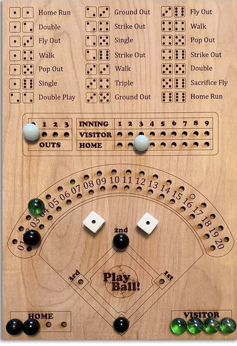
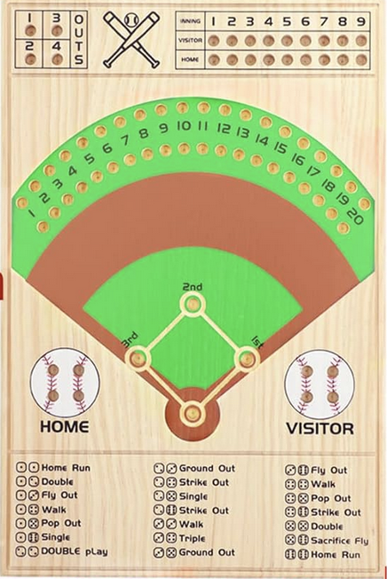
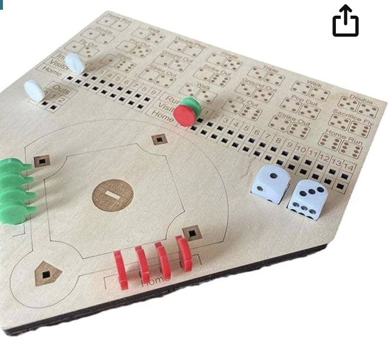
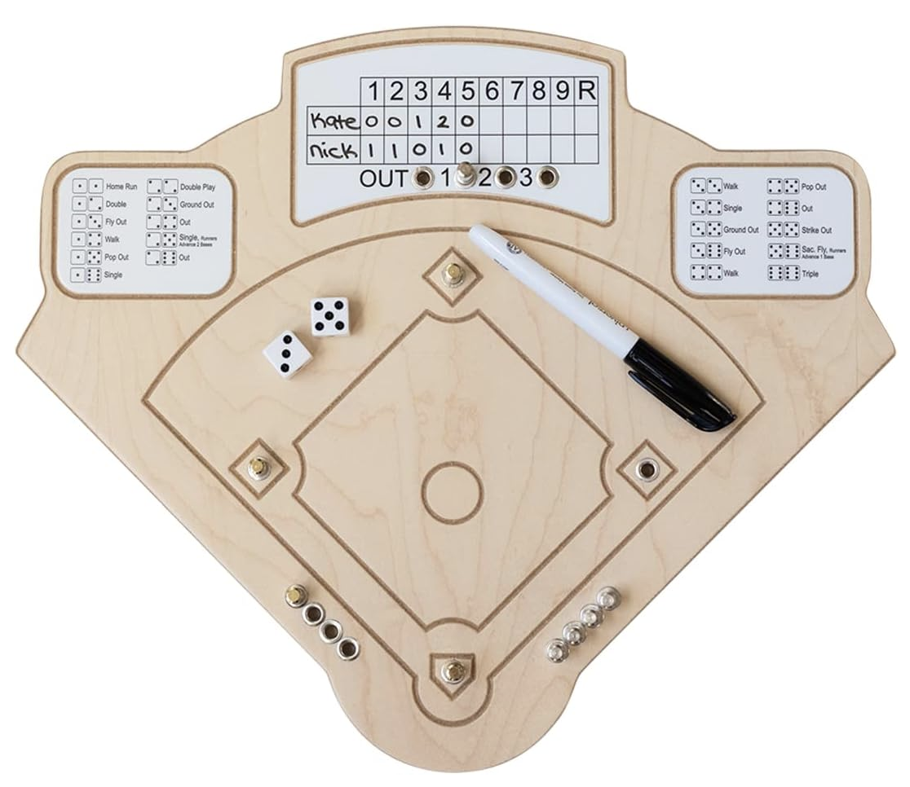

Copyright © Crane Softwrights Ltd.

Copyright is claimed on the board layout and the extended play rules only, but not on the basic play rules dice combinations.

The basic play rules dice combinations are compatible with many other baseball dice games. A quick search on Amazon found these four examples of games for sale by different companies that all use the same dice combinations:

    

The extended play dice combinations replace those combinations in basic play that specify pitching-based play results.

