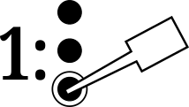
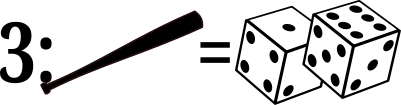
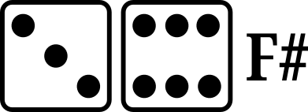
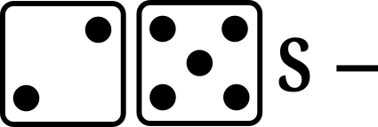
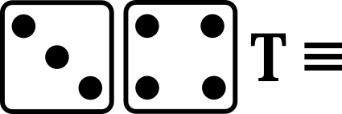
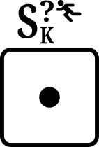
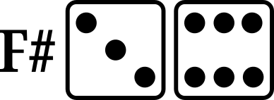
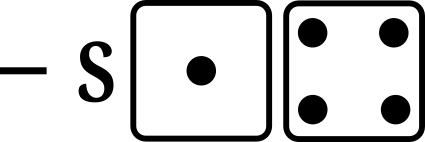

# A board baseball game to teach the sport

Copyright © Crane Softwrights Ltd.

*(Skip the introduction and jump to: [Basic Play](#basic-mode-play) or [Extended Play](#extended-mode-play))* 

This project develops a board game along the lines of the basic long-played baseball board game, but brought up to date to include new rule changes at MLB. Differing from other board baseball games, this one aims to educate the players on the rules, the notations, and the conventions used when scoring a baseball game, using official abbreviations used by MLB.

Also, this version introduces an extended play that involves pitching, something not included in the original. With pitching, both players are rolling dice for each inning. There is sufficient detail in this alternative play that a game can be scored in order to practice scoring techniques. Crane's own scoring conventions are documented for consideration.

Both the original basic "only batter rolls dice" and this new extended "batter and pitcher both roll dice" are played on the same board with the basic mode using only a subset of the play pieces. The setup and play involved for both basic and extended modes of play are described below.

## The essence of baseball play

At its core, baseball is a game of two teams, a visiting team and a home team, each taking turns in offense and defense. The goal for the offensive team (batting) is to score runs by successfully hitting the ball and advancing around a series of four bases arranged in a diamond shape. The defensive team (pitching) aims to prevent the offensive team from scoring by pitching, fielding the ball, and making outs to take offensive team players off the field.

At least nine innings are played, where in the "top" of the inning the visiting team is batting on offence and in the "bottom" of the inning the home team is batting on offence. The "middle" of the inning is the time between the top and bottom of the inning. The "end" of the inning is the time between the bottom of the inning and the top of the next inning. A given half-inning ends when the offence tallies three outs.

The batter can reach base and become a base runner if they are not put out in a defensive play. A run is scored when a base runner reaches home plate. The objective of the each team is to plate more runs than their opponent. The tally of runs and hits is tracked for both teams, and the tally always is reported in the order of the number of runs before the number of hits.

The concept of "scoring a game" is to transcribe a record of each of the plays, including if desired even each of the pitches, of every batter than comes to the plate. The pace and tenor of the game can be reviewed during the game and after the end of the game.

Should the home team be in the lead at the middle of the ninth inning, the game ends with the given score.

Should the home team become in the lead in the bottom of the ninth inning, the game ends with the given score and further runs are not attempted.

Should the visiting team be in the lead at the end of the ninth inning, the game ends with the given score.

Should the score be tied at the end of the ninth inning, an extra inning (both top and bottom halves) is played. 

In an extra inning, the team batting places the team's previous inning's final batter as a base runner at second base before the first batter of the extra inning approaches the plate for play.

Should the home team become in the lead in the bottom of the extra inning, the game ends with the given score and further runs are not attempted.

Should the visiting team be in the lead at the end of the extra inning, the game ends with the given score.

Should the score be tied at the end of the extra inning, another extra inning is played as described above.

## Basic-mode play 

Use the play board with this marking between the columns: , available for print in the PDF file: [`basic-print-board-baseball-crane.pdf`](../shared/basic-print-board-baseball-crane.pdf) (200mm x 256mm at 100% scale; suitable for both A4 and US-letter page sizes)

- see [Basic Setup](../shared/Z-SETUP.md) for details

- in the basic mode there is no pitching

- the player batting rolls two dice to determine the play according to the instructions at the dice combination below (click on the dice combination for details of each play):

| | | | | |
| :--- | :--- | :--- | :--- | :--- |
|| || ||
|| || ||
|| || ||
|| || ||
|| || ||
|| || ||
|| || ||

- in the basic mode there is no nuanced control for base runners

## Extended-mode play 

Use the play board with this marking between the columns: , available for print in the PDF file: [`extended-print-board-baseball-crane.pdf`](../shared/extended-print-board-baseball-crane.pdf) (200mm x 256mm at 100% scale; suitable for both A4 and US-letter page sizes)

- see [Extended Setup](../shared/X-SETUP.md) for details

- the team associated with the top or bottom of the inning goes up to bat
- the batter's strike zone is an imaginary area above home plate in the horizontal and extending in the vertical from the batter's knees up to the mid-point between the top of the batter's pants and the batter's shoulders 
- a ball is a pitch thrown outside of the batter's strike zone when the batter does not "offer" at the pitch by swinging
- a strike is a pitch thrown inside of the batter's strike zone or any pitch at which the batter offers by swinging
- the batter making contact with the pitch but resulting in the ball being outside of the third-base line and the first-base line makes for a "foul ball"
- the tally of runs and hits is recorded for the batter and always is reported in the order of number of balls before the number of strikes
- the pitcher rolls one die (of a colour different from the dice used by the batter) to determine which pitch is thrown
- four balls  moves the batter to first base, which, if occupied, moves the first-base runner to second base, which, if occupied, moves the second-base runner to third base, which, if occupied, moves the third-base runner to home for a score
- a foul ball  counts as a strike only when there are fewer than two strikes against the batter, otherwise there is no change in the tally of balls and strikes
- a swinging third strike  or a looking third strike  is an out for the batter and the out is recorded for the team's inning
- the batter making contact with the pitch with  or  puts the ball "in play" in between the third-base line and the first-base line

- when there are no base runners and the game is not being scored, the player batting rolls two dice to determine the play according to the instructions at the dice combination below (click on the dice combination for details of each play):

| | | | | |
| ---: | ---: | ---: | ---: | ---: |
|  |  |  |  |  |
|  |  |  |  |  |
|  |  |  |  |  |
|  |  |  |  |  |
|  |  |  |  |  |
|  |  |  |  |  |
|  |  |  |  |  |

- when there are base runners or the game is being scored, the batter rolls three dice (two dice of one colour for the batter and one die of a different colour for the base runners) to determine as above how the pitch is put in play and the impact of the play on the runners, thus guiding how the play is scored

## Physical box assembly

See the [building instructions](../build/#readme) for a collection of image files for laser engraving/cutting. The assumption is a line of size .001mm is a cut request.

The image files are 250mm x 270mm each and, after cutting, the layers can be aligned for laminating by using the two 3/16" holes outside of the playing area. The alignment guides can be shaved off when the laminating is completed.

There are five layers in total to be cut in order to fashion the entire box. Each layer is assumed to be 3/16" in order to fit four 12mm dice in the storage compartment and to fit the play board in its cradle.

