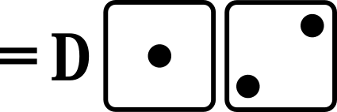
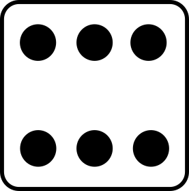
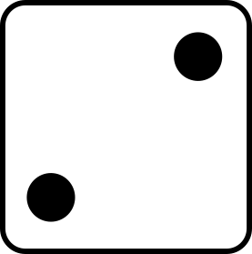
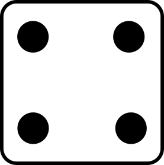

<h2>Extended play summary </h2>

|||||        

|||||        

|||||        

|||||        

|||||        

|||||        

|||||    

<h2>P# - Pop-out</h2>

- the ball is popped up and caught by the infielder indicated by the number on the die 
- the batter is out and the runners do not advance

<h2>FO/FC - Force-out and Fielder's choice</h2>

- the ball is fielded by the infielder indicated by the number on the die
- the batter and all runners advance one base
- the number on the die is associated with a single out as indicated, listing in priority order the base at which the first runner is found and called out
- , , and  indicate “1B” 
  - the batter arriving at first base is called out and is scored as being forced out
  - other runners that have advanced one base are safe
  - a runner arriving at home scores a run
-  indicates “2B”, and “1B” 
  - a base runner arriving at second base is called out and the batter is scored as reaching first base on a fielder’s choice
  - if there is no runner arriving at second base, the batter arriving at first base is called out and is scored as being forced out
-  indicates "3B", “2B”, and “1B” 
  - a base runner arriving at third base is called out and the batter is scored as reaching first base on a fielder’s choice
  - if there is no runner arriving at third base, a base runner arriving at second base is called out and the batter is scored as reaching base on a fielder’s choice
  - if there is no runner arriving at second base, the batter arriving at first base is called out and is scored as being forced out
-  indicates “H”, “3B”, “2B”, and “1B” 
  - a base runner arriving at home is called out and the batter is scored as reaching first base on a fielder’s choice
  - if there is no base runner arriving at home, a base runner arriving at third base is called out and the batter is scored as reaching base on a fielder’s choice
  - if there is no runner arriving at third base, a base runner arriving at second base is called out and the batter is scored as reaching base on a fielder’s choice
  - if there is no runner arriving at second base, the batter arriving at first base is called out and is scored as being forced out

<h2>F# - Fly-out</h2>

- the ball is fielded by the outfielder associated with the number on the die
- the batter is out
- for all rolls of the die if there are less than two out, a runner at third base reaches home and the run is scored
- if the ball is fielded by the right fielder, indicated by  or , a runner at second base reaches third base
- otherwise, runners at second base and first base remain at their base

<h2>DP - Double play</h2>

- if there are less than two base runners, both the batter and the base runner are out
- if there are two or three base runners:
  -  and  indicate the two leading base runners are out and the batter and any other base runner are safe at their new base
  -  and  indicate the leading base runner and the batter are out and any other base runners are safe at their new base
  -  and  indicate the trailing base runner and the batter are out and any other base runners are safe at their new base

<h2>Plays</h2>

a home run

a double

a fly out to an outfield fielder

a base on balls

a pop-out to an infield fielder

a single

a double play (two outs)

a force out or a fielder's choice <a href="#fo-fc">see FO-FC</a>

a strike out on a swinging strike

a single

a strike out on a looking strike (no swing)

a base on balls

a triple

a force out or a fielder's choice <a href="#fo-fc">see FO-FC</a>

a fly out to an outfield fielder

a base on balls

a pop-out to an infield fielder

a strikeout with a swinging strike

a double

a sacrifice fly (fly-out to an outfield fielder)

a runner at third base successfully crosses home plate for a run

a home run

</body>
</html>
