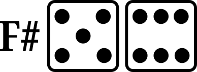
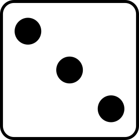

# Extended play summary 

Copyright © Crane Softwrights Ltd.
[https://GitHub.com/CraneSoftwrights/board-baseball](https://GitHub.com/CraneSoftwrights/board-baseball)  
[https://GitHub.com/CraneSoftwrights/board-baseball/blob/main/English/X-PLAYS.md](https://GitHub.com/CraneSoftwrights/board-baseball/blob/main/English/X-PLAYS.md)  
[https://GitHub.com/CraneSoftwrights/board-baseball/blob/main/English/X-PLAYS.md.html](https://GitHub.com/CraneSoftwrights/board-baseball/blob/main/English/X-PLAYS.md.html)  

| | | | | |
| ---: | ---: | ---: | ---: | ---: |
|  |  |  |  |  |
|  |  |  |  |  |
|  |  |  |  |  |
|  |  |  |  |  |
|  |  |  |  |  |
|  |  |  |  |  |
|  |  |  |  |  |

## P# - Pop-out

- the ball is popped up and caught by the infielder indicated by the number on the die 
- the batter is out and the runners do not advance

## FC/FO - Fielder's choice and force-out

- the ball is fielded by the infielder indicated by the number on the die
- the batter and all runners advance one base
- the number on the die is associated with a single out as indicated, listing in priority order the base at which the first runner is found and called out
- , , and  indicate “1B” 
  - the batter arriving at first base is called out and is scored as being forced out
  - other runners that have advanced one base are safe
  - a runner arriving at home scores a run
-  indicates “2B”, and “1B” 
  - a base runner arriving at second base is called out and the batter is scored as reaching first base on a fielder’s choice
  - if there is no runner arriving at second base, the batter arriving at first base is called out and is scored as being forced out
-  indicates "3B", “2B”, and “1B” 
  - a base runner arriving at third base is called out and the batter is scored as reaching first base on a fielder’s choice
  - if there is no runner arriving at third base, a base runner arriving at second base is called out and the batter is scored as reaching base on a fielder’s choice
  - if there is no runner arriving at second base, the batter arriving at first base is called out and is scored as being forced out
-  indicates “H”, “3B”, “2B”, and “1B” 
  - a base runner arriving at home is called out and the batter is scored as reaching first base on a fielder’s choice
  - if there is no base runner arriving at home, a base runner arriving at third base is called out and the batter is scored as reaching base on a fielder’s choice
  - if there is no runner arriving at third base, a base runner arriving at second base is called out and the batter is scored as reaching base on a fielder’s choice
  - if there is no runner arriving at second base, the batter arriving at first base is called out and is scored as being forced out

## F# - Fly-out

- the ball is fielded by the outfielder associated with the number on the die
- the batter is out
- for all rolls of the die if there are less than two out, a runner at third base reaches home and the run is scored
- if the ball is fielded by the right fielder, indicated by  or , a runner at second base reaches third base
- otherwise, runners at second base and first base remain at their base

## DP - Double play

- if there are less than two base runners, both the batter and the base runner are out
- if there are two or three base runners:
  -  and  indicate the two leading base runners are out and the batter and any other base runner are safe at their new base
  -  and  indicate the leading base runner and the batter are out and any other base runners are safe at their new base
  -  and  indicate the trailing base runner and the batter are out and any other base runners are safe at their new base

## Plays

### 1-1 

- a home run
- the batter and all runners score

### 1-2 

- a double
- all runners advance two bases and the batter ends up at second base

### 1-3 

- a fly out to an outfield fielder ([see Fly-out](X-PLAYS.md#f---fly-out))

### 1-4 

- a single
- batter and all runners advance one base

### 1-5 

- a pop-out to an infield fielder ([see Pop-out](X-PLAYS.md#p---pop-out))

### 1-6 

- a single
- batter and all runners advance one base

### 2-2 

- a double play ([see DP](X-PLAYS.md#dp---double-play))

### 2-3 

- a force out or a fielder's choice ([see FC-FO](X-PLAYS.md#fofc---force-out-and-fielders-choice))

### 2-4 

- a force out or a fielder's choice ([see FC-FO](X-PLAYS.md#fofc---force-out-and-fielders-choice))

### 2-5 

- a single
- all runners advance one base and the batter ends up at first base

### 2-6 

- a force out or a fielder's choice ([see FC-FO](X-PLAYS.md#fofc---force-out-and-fielders-choice))

### 3-3 

- a single
- all runners advance one base and the batter ends up at first base

### 3-4 

- a triple
- all runners score and the batter ends up at third base

### 3-5 

- a force out or a fielder's choice ([see FC-FO](X-PLAYS.md#fofc---force-out-and-fielders-choice))

### 3-6 

- a fly out to an outfield fielder ([see Fly-out](X-PLAYS.md#f---fly-out))

### 4-4 

- a single
- all runners advance one base and the batter ends up at first base

### 4-5 

- a pop-out to an infield fielder ([see Pop-out](X-PLAYS.md#p---pop-out))

### 4-6 

- a force out or a fielder's choice ([see FC-FO](X-PLAYS.md#fofc---force-out-and-fielders-choice))

### 5-5 

- a double
- all runners advance two bases and the batter ends up at second base

### 5-6 

- a fly-out to an outfield fielder ([see Fly-out](X-PLAYS.md#f---fly-out))

### 6-6 

- a home run
- the batter and all runners score

