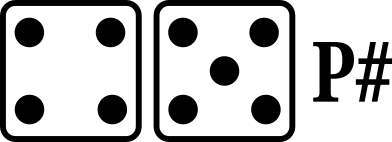

# Basic play summary 

 | :--- | :--- | :--- | :--- | :--- |
||||||
||||||
||||||
||||||
||||||
||||||
||||||
    
## Plays

### 1-1 

- a home run

### 1-2 

- a double

### 1-3 

- a fly out to an outfield fielder

### 1-4 

- a base on balls

### 1-5 

- a pop-out to an infield fielder

### 1-6 

- a single

### 2-2 

- a double play (two outs)

### 2-3 

- a force out or a fielder's choice

### 2-4 

- a strike out on a swinging strike

### 2-5 

- a single

### 2-6 

- a strike out on a looking strike (no swing)

### 3-3 

- a base on balls

### 3-4 

- a triple

### 3-5 

- a force out or a fielder's choice

### 3-6 

- a fly out to an outfield fielder

### 4-4 

- a base on balls

### 4-5 

- a pop-out to an infield fielder

### 4-6 

- a strikeout with a swinging strike

### 5-5 

- a double

### 5-6 

- a sacrifice fly (fly-out to an outfield fielder)
- a runner at third base successfully crosses home plate for a run

### 6-6 

- a home run

  </body>
</html>

