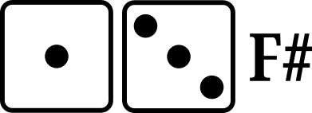
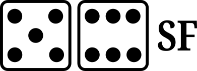

# Plays in the basic mode of display

| |A|
| :---: | :---: |
| XYZ |  |
 
| :--- | :--- | :--- | 
|  |  |  | 
|  |  |  | 
|  |  |  | 
|  |  |  | 
|  |  |  | 
|  |  |  | 
|  |  |  | 

### 

- a home run

- a double

- a fly out to an outfield fielder

- a base on balls

- a pop-out to an infield fielder

- a single

- a double play (two outs)

- a force out or a fielder's choice (see [FO-FC](#fo-fc))

- a strike out on a swinging strike

- a single

- a strike out on a looking strike (no swing)

- a base on balls

- a triple

- a force out or a fielder's choice (see [FO-FC](#fo-fc))

- a fly out to an outfield fielder

- a base on balls

- a pop-out to an infield fielder

- a strikeout with a swinging strike

- a double

- a sacrifice fly (fly-out to an outfield fielder)
- a runner at third base successfully crosses home plate for a run

- a home run

