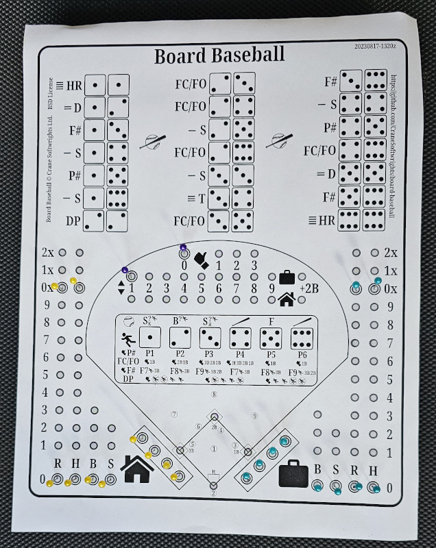
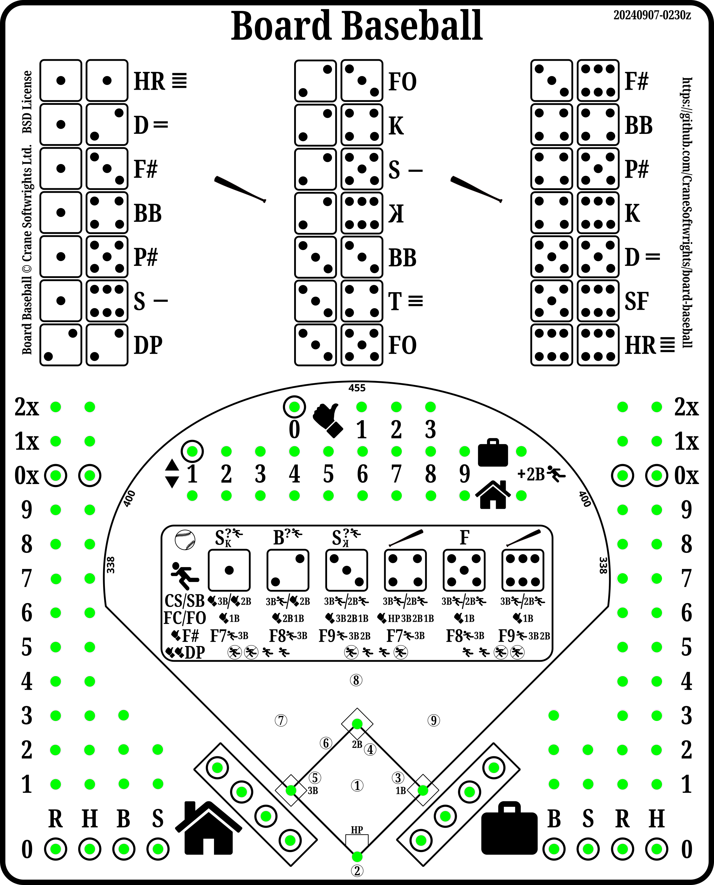

# Board Baseball

A board baseball game to teach the sport to spectators. One of the [games created by Crane Softwrights Ltd.](https://github.com/CraneSoftwrights/games) for free download from GitHub.

Copyright © Crane Softwrights Ltd. ([copyright details](LICENSE))  
Development: [`https://github.com/CraneSoftwrights/board-baseball`](https://github.com/CraneSoftwrights/board-baseball)  
Tip jar: [`https://paypal.me/CraneSoftwrights`](https://paypal.me/CraneSoftwrights)   
Browser pages: [`https://cranesoftwrights.github.io/board-baseball/README.md.html`](https://cranesoftwrights.github.io/board-baseball/README.md.html)  

          

Rules, resources, and instructions *(see the bottom of this page regarding adding a new language)*:

- [English rules, resources, and instructions](en/README.md#readme) - [README.md](en/README.md)

Print images *(click the image then use the download icon at top right beside the pencil)*:

<table width="100%">
<tr>
<td width="50%" valign="top">PBF Print board extended-mode play surface image: </td>  
<td width="50%" valign="top">PBF Print basic-mode play surface image: </td>  
</tr>
<tr>
<td width="50%" valign="top">PBF Print board combo front surface image: </td>  
<td width="50%" valign="top">PBB Print board back surface image: </td>  
</tr>
<td colspan="2">Crane's Baseball Scorecard print image: </td>
</tr>
</table>

## Adding additional language support

To add support for another language, copy the [`en/`](en/) directory and translate each of the files without changing the file names. Then modify this file and the `README.md` file found in each of the subdirectories with a language entry to point to the appropriate file in the new directory. New language files are not to be added in any of the existing subdirectories, only the introduced language-specific directory.
