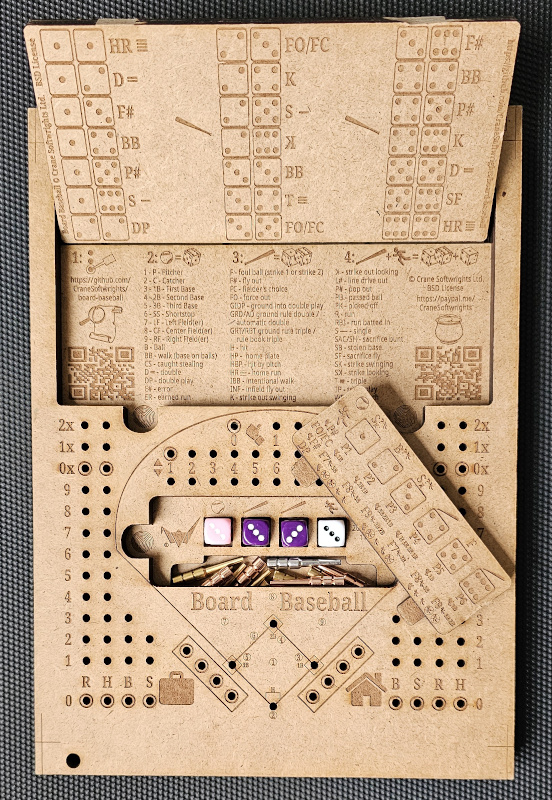
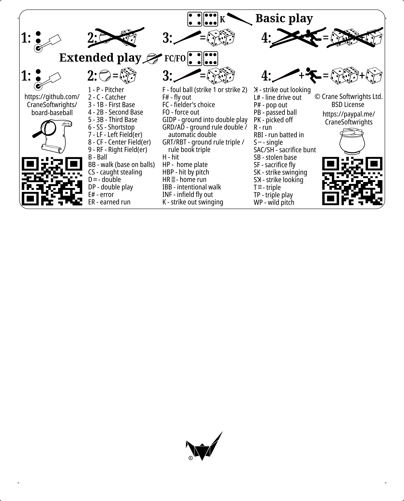
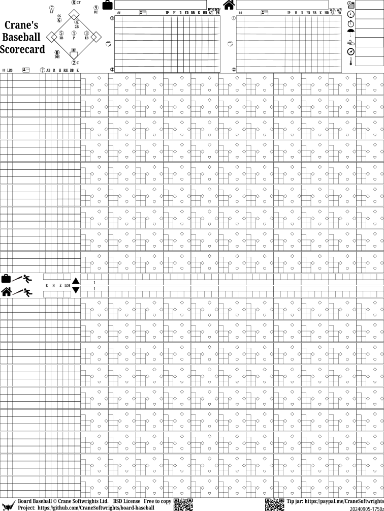

# A board baseball game to teach the sport to spectators

Copyright © Crane Softwrights Ltd.  
Development: [`https://github.com/CraneSoftwrights/board-baseball`](https://github.com/CraneSoftwrights/board-baseball)  
Tip jar: [`https://paypal.me/CraneSoftwrights`](https://paypal.me/CraneSoftwrights)   
Browser pages: [`https://cranesoftwrights.github.io/board-baseball/README.md.html`](https://cranesoftwrights.github.io/board-baseball/README.md.html)  

     

Languages *(see the bottom of this page regarding adding a new language)*:

- [English](en/README.md#readme) - [README.md](en/README.md)

  
  
  

## Adding additional language support

To add support for another language, copy the [`en/`](en/) directory and translate each of the files without changing the file names. Then modify this file and the `README.md` file found in each of the subdirectories with a language entry to point to the appropriate file in the new directory. New language files are not to be added in any of the existing subdirectories, only the introduced language-specific directory.
