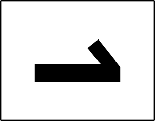

# Build resources

These are the resources used to build a 3-dimensional box using a laser printer to cut multiple layers according to a PDF file for each layer.

  

## Terminology

| Key | Legend |
| ---- | ---- |  
|  | A = alignment hole  B = panel trench  C = panel  D = panel cradle  E = compartment  F = compartment lid  G = board |  

## Board layers

The design is optimized for six layers of 1/8"=3mm material that are laminated together to create a box 3/4"=19mm tall. Alternatively, one can use 3/16"=5mm material, but of course this would make the box 3/8" taller at 9/8"=29mm. This is mentioned because quality 1/8"=3mm material may be hard to find.

The layers are numbered to be distinguished from each other. At this time there are two choices for the back layer: number 6 is blank and number 7 has a simple border. It is anticipated that future candidate back covers might include a written or graphic summary of the rules of play.

Layers 2 and 5 are special in that they have no visible printed or play content, only holes and chambers. This property permits you to use an alternative material for layers 2 and 5 than for the other layers. All of the other layers have at least some exposure to the players, and the burning is designed to work if the material has only one "good" side, so it is not necessary to purchase material that has two "good" sides.

The test layer is positioned such that it can overlay layer 2. After burning the test layer, one can burn a layer 2 on the flip side of the same piece of material. Thus, one could do a first test burn, adjust the settings and orient the surface positioning a different layer 2 at the home position and do a second test burn with the new parameters. Then layer 2 burns can overlay the test burns.

## Materials list

In addition to the board material being cut and assembled, the following items are useful in construction and play. Included are illustrative examples of the commercial availability of some of the materials, though these are not to be regarded as recommendations or requirements, just examples of materials that have worked for the two designers:

- 9"x12" blank burn boards 1/8"=3mm thick (alternatively 3/8"=5mm)
  - 6-count in total, possibly combined in larger dimensions of material
  - the equipment available to the designers works with either 9"x24", 18"x24", or 27"x24" pieces of material, thus governing the sizes below
    - using Inkscape one could build any arbitrary combination of  
  - the masters below accommodate your use of either 9"x12", 9"x24", or 18"x24" material dimensions
  - the play area is 200mm x 256mm which fits both on A4 and US-letter paper page sizes
- 12mm dice
  - 4-count optionally in three colours - one for pitching, two for batting, one for running
  - e.g. [`https://www.amazon.ca/dp/B08F72SLYD`](https://www.amazon.ca/dp/B08F72SLYD)
- cribbage pegs
  - basic play - 14-count optionally in up to three colours (see [Basic setup](../shared/Z-SETUP.md))
  - extended play - 22-count optionally in up to three colours (see [Extended setup](../shared/X-SETUP.md))
  - e.g. [`https://www.amazon.ca/dp/B08B41LNS4`](https://www.amazon.ca/dp/B08B41LNS4)
- 12mm x 3mm earth magnets
  - 18- or 20-count (see laminating steps)
  - e.g. [`https://www.amazon.ca/dp/B09XJ4SS23`](https://www.amazon.ca/dp/B09XJ4SS23)
- 12mm outside diameter washers 1/16" thick as filler to bring the 1/8" magnets flush with the surface of the 3/16" material
  - 8-count
- 1/4" bolt, nut, and two wide washers for alignment holes during board gluing
  - 6-count: two for the board, two for the compartment lid, two for the play panel

### Important safety note

Remember that the magnets are small and dangerous for children should they become loose, much like the small dice and cribbage pegs only moreso.

## Working with the magnets

It isn't important to know which side of the earth magnets is positive and which is negative, so long as you are consistent in making the interpretation the same for every magnet you are using. One helpful tip is to "label" your choice of positive for each magnet with a small piece of masking tape. Once all the magnets are in position for a given layer, the tape can be removed before binding on the next layer.

Each magnet hole has next to it an indication of which polarity is "up" when the material is placed flat on the table. Note that after laminating layer 2 onto layer 3 and all that is left is to laminate layer 1, there are four vertically-mounted magnets near the top of the box. Each is annotated with the polarity direction for dropping in the magnet.

## Laminating steps

### Main board

Put the back level face down and add two 1/4" bolts pointing up through the two alignment holes (using a washer to protect the face of the back).

Add adhesive to the back of level 5 and place it face up on the back level by putting the alignment holes over the bolts pointing up. Finely tune the positioning of the level before the adhesive sets.

Place six or eight magnets in the holes with the indicated polarity facing up. The two marked with a question mark are optional if your material is heavy and you think more anchoring is necessary. Certainly having them there doesn't hurt.

Add adhesive to the back of level 4 and place it face up on level 5 by putting the alignment holes over the bolts pointing up. Finely tune the positioning of the level before the adhesive sets.

Add adhesive to the back of level 3 and place it face up on level 4 by putting the alignment holes over the bolts pointing up. Finely tune the positioning of the level before the adhesive sets.

Add adhesive to the back of level 2 and place it face up on level 3 by putting the alignment holes over the bolts pointing up. Finely tune the positioning of the level before the adhesive sets.

Place the vertically-oriented magnets in the assembled slots above the panel cradle, careful to get the polarity correct as indicated. 
Add adhesive to the back of level 1 and place it face up on level 2 by putting the alignment holes over the bolts pointing up. Finely tune the positioning of the level before the adhesive sets.

Add a washer and nut to each of the alignment bolts and tighten loosely. Use weight or other clamps 

### Panel

Put the level 3 panel face down and add two 1/4" bolts pointing up through the two alignment holes (using a washer to protect the face of the back).

Add adhesive to the back of level 2 and place it face up on level 3 by putting the alignment holes over the bolts pointing up. Finely tune the positioning of the level before the adhesive sets.

Place six magnets in the holes with the indicated polarity facing up. There are no optional magnets on this level.

Add adhesive to the back of level 1 and place it face up on level 2 by putting the alignment holes over the bolts pointing up. Finely tune the positioning of the level before the adhesive sets.

Add a washer and nut to each of the alignment bolts and tighten loosely. Use weight or other clamps 

### Compartment lid

Put the level 3 panel face down and add two 1/4" bolts pointing up through the two alignment holes (using a washer to protect the face of the back).

Add adhesive to the back of level 2 and place it face up on level 3 by putting the alignment holes over the bolts pointing up. Finely tune the positioning of the level before the adhesive sets.

Place two magnets in the holes with the indicated polarity facing up. There are no optional magnets on this level.

Add adhesive to the back of level 1 and place it face up on level 2 by putting the alignment holes over the bolts pointing up. Finely tune the positioning of the level before the adhesive sets.

Add a washer and nut to each of the alignment bolts and tighten loosely. Use weight or other clamps 

## Burn files

These are the files used to burn in a laser cutter, tested in an Epilog Helix branded machine:

9"x12": , , , , , , , and  

These are collages of layer images arranged tête-à-tête for board levels with a finished side that are user-facing:

18"x24":  and   
9"x24": , , and 

These are collages of layer images arranged tête-à-tête for internal unfinished board levels that are not user-facing:

18"x24":  
9"x24": 

These are collages of layer images arranged tête-à-tête for all boards in a single burn:

27"x24":  and   

A number of convenience cutting files (without any text) are available should you wish to carve up pieces of material with simple cuts:

18"x24": , , and   
18"x12": 
9"x24": 

Copy the `design-board-baseball-crane.svg` file replacing all of the numbered and "T" SVG files found in the [`../build`](../build) directory using the target name `objects-#-9x12-collage-board-baseball-crane.svg`:
- `objects-T-9x12-collage-board-baseball-crane.svg`
- `objects-1-9x12-collage-board-baseball-crane.svg`
- `objects-2-9x12-collage-board-baseball-crane.svg`
- `objects-3-9x12-collage-board-baseball-crane.svg`
- ...

For each of the newly-created SVG files:
- open the file in Inkscape
- delete every layer except the combined layer
- un-hide the combined layer (which should show everything)
- select the layer and rotate it 90 degrees clockwise
- in the Document Properties dialogue, "Resize to content" (should result in 12" x 9")
- save the SVG and quit Inkscape (in my copy of Inkscape I cannot open from the file system when the application is open already)

The "objects" individual files then are copied "burn" individual files, replacing the old "burn" individual files:

- `burn-T-9x12-collage-board-baseball-crane.svg`
- `burn-1-9x12-collage-board-baseball-crane.svg`
- `burn-2-9x12-collage-board-baseball-crane.svg`
- `burn-3-9x12-collage-board-baseball-crane.svg`
- ...

The "burn" collage files then, indiviually, have the following modifications made before saving them as complete:

- open the file in Inkscape and unlock the top-most layer
- all objects are selected using the top-most and the menu item "Path/Object to Path" is used to convert the fonts to paths
- all objects below the top-most layer are ungrouped until there are no more groups below the top-most layer
- a single magenta cut line is selected using right-click/Select Same.../Stroke color which selects every cut line in the entire collage
- the stroke width of all lines is changed with a single entry of .001in in the Fill and Stroke dialogue
- save the SVG and quit Inkscape

Layers from the individual burn files are copied into the combined collage burn files by creating an empty SVG file of the target dimension, creating and naming the top layer, importing the individual files, and placing them tête-à-tête on the page as required:

[`burn-13-9x24-collage-board-baseball-crane.svg`](burn-13-9x24-collage-board-baseball-crane.svg)  
[`burn-46-9x24-collage-board-baseball-crane.svg`](burn-46-9x24-collage-board-baseball-crane.svg)  
[`burn-47-9x24-collage-board-baseball-crane.svg`](burn-47-9x24-collage-board-baseball-crane.svg)  
[`burn-25-9x24-collage-board-baseball-crane.svg`](burn-25-9x24-collage-board-baseball-crane.svg)  
[`burn-1346-18x24-collage-board-baseball-crane.svg`](burn-1346-18x24-collage-board-baseball-crane.svg)  
[`burn-1347-18x24-collage-board-baseball-crane.svg`](burn-1347-18x24-collage-board-baseball-crane.svg)  
[`burn-2525-18x24-collage-board-baseball-crane.svg`](burn-2525-18x24-collage-board-baseball-crane.svg)  
[`burn-134625-27x24-collage-board-baseball-crane.svg`](burn-134625-27x24-collage-board-baseball-crane.svg)  
[`burn-134725-27x24-collage-board-baseball-crane.svg`](burn-134725-27x24-collage-board-baseball-crane.svg)  

The PDF files created from the "burn" collage files are what are sent to the appropriate laser; note that the printing of the SVG may unexpectedly rotate the image 180 degrees, needing rotating in the PDF files recreating the file from temporarily rotating the SVG (but not saving the changes):

[`burn-1-9x12-collage-board-baseball-crane.pdf`](burn-1-9x12-collage-board-baseball-crane.pdf)  
[`burn-2-9x12-collage-board-baseball-crane.pdf`](burn-2-9x24-collage-board-baseball-crane.pdf)  
[`burn-3-9x12-collage-board-baseball-crane.pdf`](burn-3-9x12-collage-board-baseball-crane.pdf)  
[`burn-4-9x12-collage-board-baseball-crane.pdf`](burn-4-9x12-collage-board-baseball-crane.pdf)  
[`burn-5-9x12-collage-board-baseball-crane.pdf`](burn-5-9x12-collage-board-baseball-crane.pdf)  
[`burn-6-9x12-collage-board-baseball-crane.pdf`](burn-6-9x12-collage-board-baseball-crane.pdf)  
[`burn-T-9x12-collage-board-baseball-crane.pdf`](burn-T-9x12-collage-board-baseball-crane.pdf)  
[`burn-13-9x24-collage-board-baseball-crane.pdf`](burn-13-9x24-collage-board-baseball-crane.pdf)  
[`burn-46-9x24-collage-board-baseball-crane.pdf`](burn-46-9x24-collage-board-baseball-crane.pdf)  
[`burn-47-9x24-collage-board-baseball-crane.pdf`](burn-47-9x24-collage-board-baseball-crane.pdf)  
[`burn-25-9x24-collage-board-baseball-crane.pdf`](burn-25-9x24-collage-board-baseball-crane.pdf)  
[`burn-1346-18x24-collage-board-baseball-crane.pdf`](burn-1346-18x24-collage-board-baseball-crane.pdf)  
[`burn-1347-18x24-collage-board-baseball-crane.pdf`](burn-1347-18x24-collage-board-baseball-crane.pdf)  
[`burn-2525-18x24-collage-board-baseball-crane.pdf`](burn-2525-18x24-collage-board-baseball-crane.pdf)  
[`burn-134625-27x24-collage-board-baseball-crane.pdf`](burn-134625-27x24-collage-board-baseball-crane.pdf)  
[`burn-134725-27x24-collage-board-baseball-crane.pdf`](burn-134725-27x24-collage-board-baseball-crane.pdf)  

The PDF files created from the cutting SVG files are as follows and shouldn't need to change:

[`cut-9x12-from-18x24.pdf`](cut-9x12-from-18x24.pdf)  
[`cut-9x24-from-18x24.pdf`](cut-9x24-from-18x24.pdf)  
[`cut-18x12-from-18x24.pdf`](cut-18x12-from-18x24.pdf)  
[`cut-9x12-from-18x12.pdf`](cut-9x12-from-18x12.pdf)  
[`cut-9x12-from-9x24.pdf`](cut-9x12-from-9x24.pdf)  

## Assembly

Our second test build is documented [here: `test-20230728.md`](test-20230728.md).

