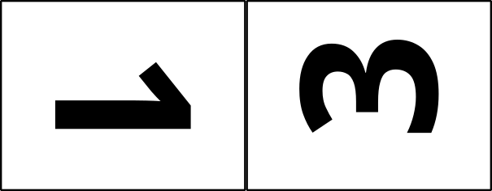

# Build resources directory

These are the files used to burn in a laser cutter. They are collages of layer images arranged tête-à-tête as follows:

18"x24":   
9"x24":

Layers from the design files are copied into the objects collage files for organization purposes:

[`objects-1345-18x24-collage-board-baseball-crane.svg`](objects-1345-18x24-collage-board-baseball-crane.svg)  
[`objects-2222-18x24-collage-board-baseball-crane.svg`](objects-2222-18x24-collage-board-baseball-crane.svg)  
[`objects-13-9x24-collage-board-baseball-crane.svg`](objects-1345-18x24-collage-board-baseball-crane.svg)  
[`objects-45-9x24-collage-board-baseball-crane.svg`](objects-1345-18x24-collage-board-baseball-crane.svg)  
[`objects-22-9x24-collage-board-baseball-crane.svg`](objects-2222-18x24-collage-board-baseball-crane.svg)  

The "objects" collage files then are copied to the "burn" collage files, replacing entirely the old "burn" collage files:

[`burn-1345-18x24-collage-board-baseball-crane.svg`](burn-1345-18x24-collage-board-baseball-crane.svg)  
[`burn-2222-18x24-collage-board-baseball-crane.svg`](burn-2222-18x24-collage-board-baseball-crane.svg)  
[`burn-13-9x24-collage-board-baseball-crane.svg`](burn-13-9x24-collage-board-baseball-crane.svg)  
[`burn-45-9x24-collage-board-baseball-crane.svg`](burn-45-9x24-collage-board-baseball-crane.svg)  
[`burn-22-9x24-collage-board-baseball-crane.svg`](burn-22-9x24-collage-board-baseball-crane.svg)  

The "burn" collage files then have the following modifications made before saving them as complete:

- all objects are selected and using the menu item "Path/Object to Path" to convert the fonts to paths
- a single magenta cut line is selected using right-click/Select Same.../Stroke color which selects every cut line in the entire collage
- the stroke width of all lines is changed with a single entry of .001in in the Fill and Stroke dialogue

The PDF files created from the "burn" collage files are what are sent to the appropriate laser:

[`burn-1345-18x24-collage-board-baseball-crane.pdf`](burn-1345-18x24-collage-board-baseball-crane.pdf)  
[`burn-2222-18x24-collage-board-baseball-crane.pdf`](burn-2222-18x24-collage-board-baseball-crane.pdf)  
[`burn-13-9x24-collage-board-baseball-crane.pdf`](burn-13-9x24-collage-board-baseball-crane.pdf)  
[`burn-45-9x24-collage-board-baseball-crane.pdf`](burn-45-9x24-collage-board-baseball-crane.pdf)  
[`burn-22-9x24-collage-board-baseball-crane.pdf`](burn-22-9x24-collage-board-baseball-crane.pdf)  
