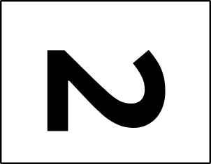
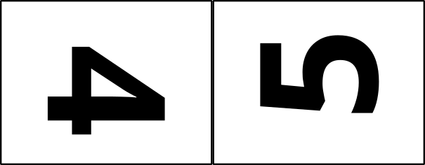
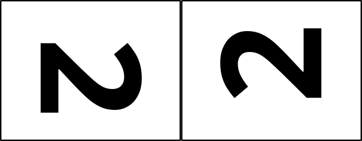

# Build resources

These are the resources used to build a 3-dimensional box using a laser printer to cut multiple layers according to a PDF file for each layer.

  

# Terminology

| ---- | ---- |  
|  | A = alignment hole  B = panel trench  C = panel  D = panel cavity  E = compartment  F = compartment lid  G = board |  

## Board layers

There are either five layers of 3/16"=5mm material or six layers of 1/8"=3mm material that are laminated together to create a box. In our tests the six layers of thinner material has worked better and the materials are cheaper.

The layers are numbered to be distinguished from each other.

The assembly choices are for five layers: 1-2-3-4-5 or 1-2-3-4-6, and for six layers: 1-2-2-3-4-5 or 1-2-2-3-4-6.

Layer 2 is special in that it has no visible printed or play content, only holes and chambers. This property permits you to use an alternative material for layer 2 than for the other layers. All of the other layers have at least some exposure to the players, and the burning is designed to work if the material has only one "good" side, so it is not necessary to purchase material that has two "good" sides.

The test layer is positioned such that it can overlay layer 2. After burning the test layer, one can burn a layer 2 on the same piece of material. Thus, one could do a first test burn, adjust the settings and orient the surface positioning a different layer 2 at the home position and do a second test burn with the new parameters. Then layer 2 burns can overlay the test burns.

Note the question marks included in the magnet polarity punch-outs on layer 2. These are a reminder for a six-layer board that the punch-outs are useful in filling the excessively deep magnet hole caused by duplicating layer 2. Alternatively, washers can be used to fill up the excess space.

## Materials list

In addition to the board material being cut and assembled, the following items are useful in construction and play. Included are illustrative examples of the commercial availability of some of the materials, though these are not to be regarded as recommendations or requirements, just examples of materials that have worked for the two designers:

- 12mm dice
  - 4-count optionally in three colours - one for pitching, two for batting, one for running
  - e.g. [`https://www.amazon.ca/dp/B08F72SLYD`](https://www.amazon.ca/dp/B08F72SLYD)
- cribbage pegs
  - basic play - 14-count optionally in up to three colours (see [Basic setup](../shared/Z-SETUP.md))
  - extended play - 22-count optionally in up to three colours (see [Extended setup](../shared/X-SETUP.md))
  - e.g. [`https://www.amazon.ca/dp/B08B41LNS4`](https://www.amazon.ca/dp/B08B41LNS4)
- 12mm x 3mm earth magnets
  - 14-count for a 5-layer board
  - 18-count for a 6-layer board
  - e.g. [`https://www.amazon.ca/dp/B09XJ4SS23`](https://www.amazon.ca/dp/B09XJ4SS23)
- 12mm outside diameter washers 1/16" thick as filler to bring the 1/8" magnets flush with the surface of the 3/16" wood
  - 8-count
- 1/4" bolt, nut, and two wide washers for alignment holes during board gluing
  - 6-count: two for the board, two for the compartment lid, two for the play panel

### Important safety note

Remember that the magnets are small and dangerous for children should they become loose, much like the small dice and cribbage pegs only moreso.

## Burn files

These are the files used to burn in a laser cutter, tested in an Epilog Helix branded machine:

9"x12": , , , , , , and  

These are collages of layer images arranged tête-à-tête as follows:

18"x24": , , and   
9"x24": , , , and 

A number of convenience cutting files (without any text) are available should you wish to carve up pieces of material with simple cuts:

18"x24": , , and   
18"x12": 
9"x24": 

Layers from the design files are copied into the individual objects files for organization purposes:

- copy the large design file into the target objects file
- delete all of the layers not belonging in the new file, leaving only the one
- make the top-most layer visible but still locked
- select and rotate the top-most layer clockwise 90 degrees
- use document properties and change the page size to the content

[`objects-1-9x12-collage-board-baseball-crane.svg`](objects-1-9x12-collage-board-baseball-crane.svg)  
[`objects-2-9x12-collage-board-baseball-crane.svg`](objects-2-9x12-collage-board-baseball-crane.svg)  
[`objects-3-9x12-collage-board-baseball-crane.svg`](objects-3-9x12-collage-board-baseball-crane.svg)  
[`objects-4-9x12-collage-board-baseball-crane.svg`](objects-4-9x12-collage-board-baseball-crane.svg)  
[`objects-5-9x12-collage-board-baseball-crane.svg`](objects-5-9x12-collage-board-baseball-crane.svg)  
[`objects-6-9x12-collage-board-baseball-crane.svg`](objects-6-9x12-collage-board-baseball-crane.svg)  
[`objects-T-9x12-collage-board-baseball-crane.svg`](objects-T-9x12-collage-board-baseball-crane.svg)  

The "objects" individual files then are saved as "burn" individual files, replacing the old "burn" individual files:

[`burn-1-9x12-collage-board-baseball-crane.svg`](burn-1-9x12-collage-board-baseball-crane.svg)  
[`burn-2-9x12-collage-board-baseball-crane.svg`](burn-2-9x12-collage-board-baseball-crane.svg)  
[`burn-3-9x12-collage-board-baseball-crane.svg`](burn-3-9x12-collage-board-baseball-crane.svg)  
[`burn-4-9x12-collage-board-baseball-crane.svg`](burn-4-9x12-collage-board-baseball-crane.svg)  
[`burn-5-9x12-collage-board-baseball-crane.svg`](burn-5-9x12-collage-board-baseball-crane.svg)  
[`burn-6-9x12-collage-board-baseball-crane.svg`](burn-6-9x12-collage-board-baseball-crane.svg)  
[`burn-T-9x12-collage-board-baseball-crane.svg`](burn-T-9x12-collage-board-baseball-crane.svg)  

The "burn" collage files then have the following modifications made before saving them as complete:

- all objects are selected using the top-most and the menu item "Path/Object to Path" is used to convert the fonts to paths
- all objects below the top-most layer are ungrouped until there are no more groups below the top-most layer
- a single magenta cut line is selected using right-click/Select Same.../Stroke color which selects every cut line in the entire collage
- the stroke width of all lines is changed with a single entry of .001in in the Fill and Stroke dialogue

Layers from the individual burn files are copied into the collage burn files:

[`burn-13-9x24-collage-board-baseball-crane.svg`](burn-13-9x24-collage-board-baseball-crane.svg)  
[`burn-45-9x24-collage-board-baseball-crane.svg`](burn-45-9x24-collage-board-baseball-crane.svg)  
[`burn-46-9x24-collage-board-baseball-crane.svg`](burn-46-9x24-collage-board-baseball-crane.svg)  
[`burn-22-9x24-collage-board-baseball-crane.svg`](burn-22-9x24-collage-board-baseball-crane.svg)  
[`burn-1345-18x24-collage-board-baseball-crane.svg`](burn-1345-18x24-collage-board-baseball-crane.svg)  
[`burn-1346-18x24-collage-board-baseball-crane.svg`](burn-1346-18x24-collage-board-baseball-crane.svg)  
[`burn-2222-18x24-collage-board-baseball-crane.svg`](burn-2222-18x24-collage-board-baseball-crane.svg)  

The PDF files created from the "burn" collage files are what are sent to the appropriate laser; note that the printing of the SVG may unexpectedly rotate the image 180 degrees, needing tweaking in the PDF files:

[`burn-1-9x12-collage-board-baseball-crane.pdf`](burn-1-9x12-collage-board-baseball-crane.pdf)  
[`burn-2-9x12-collage-board-baseball-crane.pdf`](burn-2-9x24-collage-board-baseball-crane.pdf)  
[`burn-3-9x12-collage-board-baseball-crane.pdf`](burn-3-9x12-collage-board-baseball-crane.pdf)  
[`burn-4-9x12-collage-board-baseball-crane.pdf`](burn-4-9x12-collage-board-baseball-crane.pdf)  
[`burn-5-9x12-collage-board-baseball-crane.pdf`](burn-5-9x12-collage-board-baseball-crane.pdf)  
[`burn-6-9x12-collage-board-baseball-crane.pdf`](burn-6-9x12-collage-board-baseball-crane.pdf)  
[`burn-T-9x12-collage-board-baseball-crane.pdf`](burn-T-9x12-collage-board-baseball-crane.pdf)  
[`burn-13-9x24-collage-board-baseball-crane.pdf`](burn-13-9x24-collage-board-baseball-crane.pdf)  
[`burn-45-9x24-collage-board-baseball-crane.pdf`](burn-45-9x24-collage-board-baseball-crane.pdf)  
[`burn-46-9x24-collage-board-baseball-crane.pdf`](burn-46-9x24-collage-board-baseball-crane.pdf)  
[`burn-22-9x24-collage-board-baseball-crane.pdf`](burn-22-9x24-collage-board-baseball-crane.pdf)  
[`burn-1345-18x24-collage-board-baseball-crane.pdf`](burn-1345-18x24-collage-board-baseball-crane.pdf)  
[`burn-1346-18x24-collage-board-baseball-crane.pdf`](burn-1346-18x24-collage-board-baseball-crane.pdf)  
[`burn-2222-18x24-collage-board-baseball-crane.pdf`](burn-2222-18x24-collage-board-baseball-crane.pdf)  

The PDF files created from the cutting SVG files are as follows:

[`cut-9x12-from-18x24.pdf`](cut-9x12-from-18x24.pdf)  
[`cut-9x24-from-18x24.pdf`](cut-9x24-from-18x24.pdf)  
[`cut-18x12-from-18x24.pdf`](cut-18x12-from-18x24.pdf)  
[`cut-9x12-from-18x12.pdf`](cut-9x12-from-18x12.pdf)  
[`cut-9x12-from-9x24.pdf`](cut-9x12-from-9x24.pdf)  

## Assembly

Our second test build is documented [here: `test-20230728.md`](test-20230728.md).

