# Build resources

These are the resources used to build two versions of the game using a laser cutter to etch and cut material:
- a 3-dimensional box with six layers of 1/8"-3mm material, and

  - 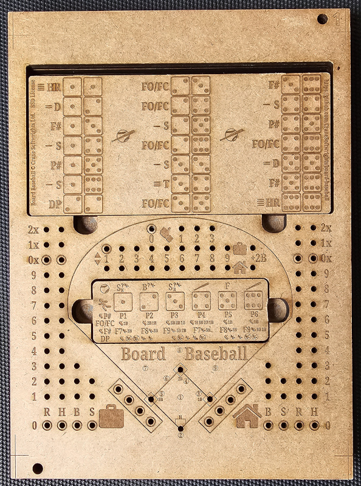  

- a single-board (of any thickness) with information on both sides

  - 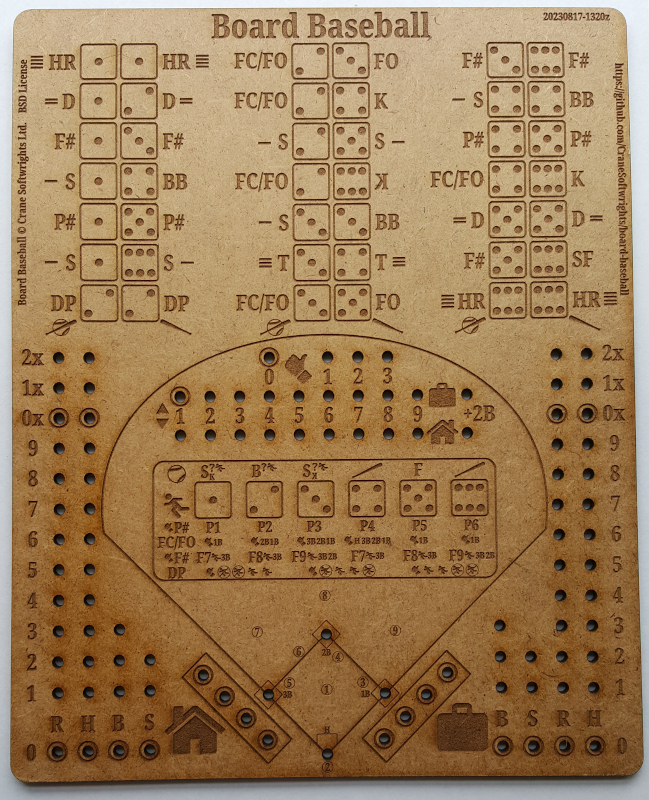 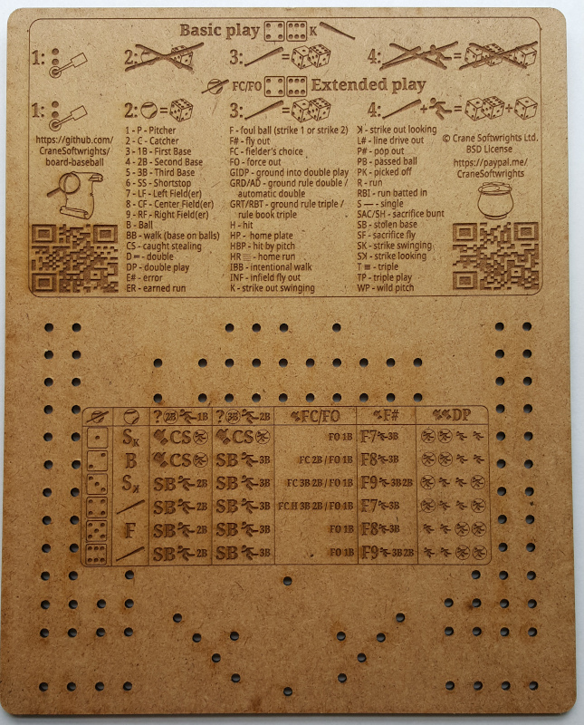 

## Terminology

| Legend | Key |
| ---- | ---- |  
| **A** = alignment hole  **B** = panel trench  **C** = panel  **D** = panel cradle  **E** = compartment  **F** = compartment lid  **G** = main board |  |  

## Board levels and SVG layers

The design is optimized for six levels of 1/8"=3mm material that are laminated together to create a box 3/4"=19mm tall. Alternatively, one can use 3/16"=5mm material, but of course this would make the box 3/8" taller at 9/8"=29mm. This is mentioned because quality 1/8"=3mm material may be hard to find.

Each level is made up of a number of SVG layers in the [design SVG master file](../design/design-board-baseball-crane.svg). See the [design notes](../design/#readme).

The levels are numbered to be distinguished from each other. At this time there are two choices for the back level: number 6 is blank and number 7 has a simple border. It is anticipated that future candidate back covers might include a written or graphic summary of the rules of play.

Levels 2 and 5 are special in that they have no visible printed or play content, only holes and chambers. This property permits you to use an alternative material for levels 2 and 5 than for the other levels. All of the other levels have at least some exposure to the plevels, and the burning is designed to work if the material has only one "good" side, so it is not necessary to purchase material that has two "good" sides.

The test level is positioned such that it can overlay level 2. After burning the test level, one can burn a second test on the flip side of the same piece of material. Thus, one could do a first test burn, adjust the settings and orient the surface positioning a different level 2 at the home position and do a second test burn with the new parameters. Then level 2 burns can overlay the test burns.

## Materials list

In addition to the board material being cut and assembled, the following items are useful in construction and play. Included are illustrative examples of the commercial availability of some of the materials, though these are not to be regarded as recommendations or requirements, just examples of materials that have worked for the two designers:

- levels of burn and cut material
  - 1-count only for the single board version
  - 6-count in total for the box, possibly combined in larger dimensions of material
  - 9"x12" is assumed for every burn
  - choice of dimensions and assuming thickness of 1/8"=3mm (alternatively 3/8"=5mm):
    - 9"x12" rectangles (burn includes alignment holes and crop marks)
    - 8"x10" rectangles (no alignment holes or crop marks)
    - "content" 200x248mm with rounded corners (no alignment holes or crop marks)
  - the equipment available to the designers works with either 9"x24", 18"x24", or 27"x24" pieces of material, thus governing the sizes below
    - using Inkscape one could build any arbitrary combination of  
  - the masters below accommodate your use of either 9"x12", 9"x24", or 18"x24" material dimensions
  - the play area is 200x248mm which fits both on A4 and US-letter paper page sizes and 8"x10" blanks
  - when working with acrylic, the local shop prohibits polycarbonates and permits polymethyl methacrylate (PMMA) 
- 12mm D6 dice
  - 4-count optionally in three colours - one for pitching, two for batting, one for running
  - e.g. [`https://www.amazon.ca/dp/B08F72SLYD`](https://www.amazon.ca/dp/B08F72SLYD)
- cribbage pegs
  - basic play - 14-count optionally in up to three colours (see [Basic setup](../shared/Z-SETUP.md))
  - extended play - 22-count optionally in up to three colours (see [Extended setup](../shared/X-SETUP.md))
  - e.g. [`https://www.amazon.ca/dp/B08B41LNS4`](https://www.amazon.ca/dp/B08B41LNS4)
    - note that 7 packages of 32 pegs makes up 10 games of 22 pegs with only two unused and the optimum 10+10+2 combination (use the [worksheet](../design/32-pegs.svg) to create game sets)
- single board version only:
  - 15mm dimension feet
    - 4-count
    - e.g. [`https://www.amazon.ca/dp/B07RYCRYY3`](https://www.amazon.ca/dp/B07RYCRYY3) but the screws provided are too long so 1/4" screws need to be purchased separately
- box version only:
  - 12mm x 3mm earth magnets
    - 18- or 20-count (see laminating steps)
    - e.g. [`https://www.amazon.ca/dp/B09XJ4SS23`](https://www.amazon.ca/dp/B09XJ4SS23) and [`https://www.amazon.ca/dp/B09XVBL8SK`](https://www.amazon.ca/dp/B09XVBL8SK)  
  - 1/4" bolt, nut, and two wide washers for alignment holes during board gluing
    - 6-count: two for the board, two for the compartment lid, two for the play panel
  - when using 3/16"=5mm thick material, one needs 12mm outside diameter washers 1/16" thick as filler to bring the 1/8" magnets flush with the surface of the material
    - 8-count

### Important safety note

Remember that the magnets are small and dangerous for children should they become loose, much like the small dice and cribbage pegs only moreso.

## Working with the magnets

It isn't important to know which side of the earth magnets is positive and which is negative, so long as you are consistent in making the interpretation the same for every magnet you are using. One helpful tip is to "label" your choice of positive for each magnet with a small piece of masking tape. Once all the magnets are in position for a given level, the tape can be removed before binding on the next level.

Each magnet hole has next to it an indication of which polarity is "up" when the material is placed flat on the table. Note that after laminating level 2 onto level 3 and all that is left is to laminate level 1, there are four vertically-mounted magnets near the top of the box. Each is annotated with the polarity direction for dropping in the magnet.

The earth magnets are very fragile and will shatter or shear off pieces if they are allowed to hit each other.

## Laminating thoughts

Two approaches for assembling the six levels have been practiced by the designers:

- one session with all six levels:
  - place the bottom level facing down with the alignment bolts with a washer facing up
  - put adhesive on the back of level 5 and position on level 6
  - put adhesive on the front of level 5
  - place magnets in the appropriate locations with the indicated polarity facing up
  - position level 4 on level 5
  - put adhesive on the back of level 3 and position on level 4
  - put adhesive on the front of level 3 and position level 2 on level 3
  - put adhesive on the front of level 2 and position level 1 on level 2
  - anchor alignment bolts with a washer and the nut
  - clamp/weigh the assembly for drying/curing

- two sessions, the first with five levels not including the backing level:
  - transcribe with a pen on the back of level 5 the polarity of the vertical magnet holes
  - transcribe with a pen on the back of level 5 the opposite polarity of the horizontal magnet noles
  - place level 5 facing up with the alignment bolts with a washer facing up
  - put adhesive on the front of level 5 and position level 4 on level 5
  - put adhesive on the back of level 3 and position on level 4
  - put adhesive on the front of level 3 and position level 2 on level 3
  - put adhesive on the front of level 2 and position level 1 on level 2
  - anchor alignment bolts with a washer and the nut
  - clamp/weigh the 5-piece assembly for drying/curing
  - inspect the completed assembly for any peg holes that need to be drilled out with a 1/8" bit, working from the back to the front
  - place the assembly facing down with the alignment bolts with a washer facing up
  - put adhesive on the back of level 5
  - place the magnets in their horizontal holes with the indicated handwritten polarity facing up, not forgetting also to add magnets to the vertical magnet holes with unchanged polarity
  - position the backing level on level 5
  - clamp/weigh the 6-piece assembly for drying/curing
  
When working with both the panel and the compartment lid:

- place level 3 facing down with the alignment bolts with a washer facing up
- put adhesive on the back of level 2 and position on level 3
- put adhesive on the front of level 2
- place magnets in the appropriate locations with the indicated polarity facing up
- position level 1 on level 2

## Burn files

### Summary of files created during this process

Pages with a single digit are levels of a physical 3-D playing board.

The abbreviations "F" and "B" are, respectively, the front and back of the single-board playing board.

These are the files used to burn in a laser cutter, tested in an Epilog Helix branded machine:

9"x12" crop: , , , , [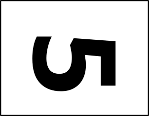](L5-frame-9x12-board-baseball-crane.pdf), , and [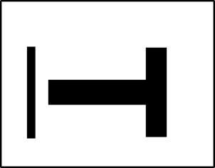](LT-frame-9x12-board-baseball-crane.pdf) 

9"x12" frame: , , , , , , , , and [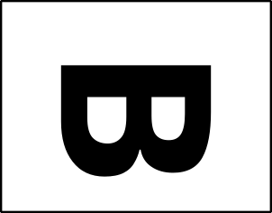](SBB-frame-9x12-board-baseball-crane.pdf) 

20mmx248mm cut: , , , , , , , , and  

These are collages of level images arranged tête-à-tête for board levels with a finished side that are user-facing:

18"x24":  and [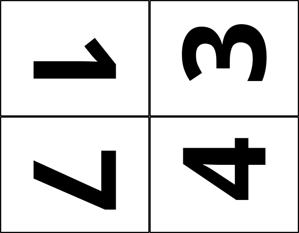](burn-1374-18x24-board-baseball-crane.pdf)  
9"x24": , , and [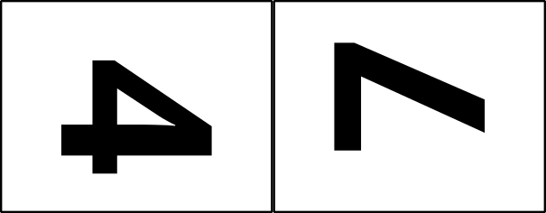](burn-47-9x24-board-baseball-crane.pdf)

These are collages of level images arranged tête-à-tête for internal unfinished board levels that are not user-facing:

18"x24": [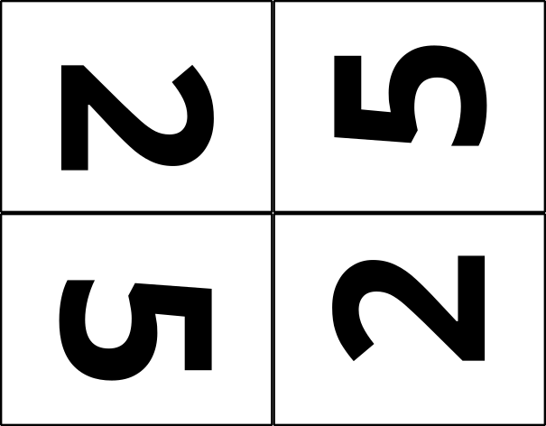](burn-2552-18x24-board-baseball-crane.pdf) 
9"x24": 

These are collages of level images arranged tête-à-tête for all boards in a single burn:

27"x24": [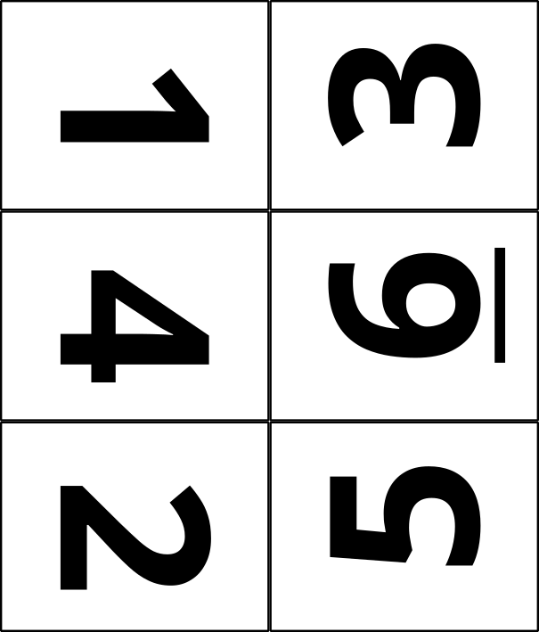](burn-134625-18x24-board-baseball-crane.pdf) and   

Two frame cutting patterns are available in order to make the scaffolding to hold a piece of material less than 9"x12" within the 9"x12" workspace:

8"x10" rectangle in 9"x12": 

200x248mm rounded rectangle in 9"x12":  [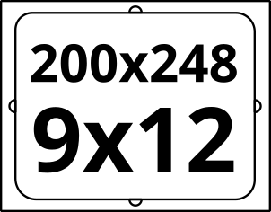](frame-200x248-in-9x12.pdf)

A number of convenience cutting files (without any text) are available should you wish to carve up pieces of material with simple cuts:

8"x10": 

18"x24": , [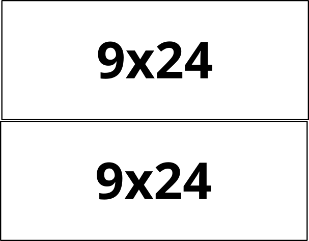](cut-9x24-from-18x24.pdf), and [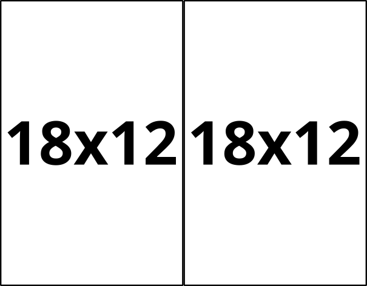](cut-18x12-from-18x24.pdf)  
18"x12": 
9"x24": [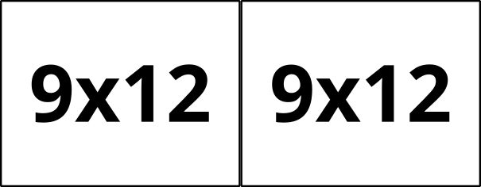](cut-9x12-from-9x24.pdf)

### Creating the burn files

If the prior version of the files hasn't been deleted, be sure to keep the `cut-*.*` and `frame-*.*` files in this directory and delete all of the `objects-*.*` and `L*burn*.*` files.

Copy the `design-board-baseball-crane.svg` file replacing all of the numbered and "T" SVG files found in the [`../build`](../build) directory using the target name `objects-#-9x12-board-baseball-crane.svg`:
- `objects-SBF-board-baseball-crane.svg`
- `objects-SBB-board-baseball-crane.svg`
- `objects-LT-board-baseball-crane.svg`
- `objects-L1-board-baseball-crane.svg`
- `objects-L2-board-baseball-crane.svg`
- `objects-L3-board-baseball-crane.svg`
- ...

For each of the newly-created SVG files:
- open the file in Inkscape
- delete every layer except for the following layers:
  - all the applicable backing layers
    - 9"x12" without crop lines (when frames are used to hold material centred)
      - choose one of front-facing or back-facing as needed for the given level
      - used to create `L*-frame-9x12-board-baseball-crane.svg`
    - 9"x12" with crop lines (front-facing and back-facing alignment holes differ)
      - used to create `L*-crop-9x12-board-baseball-crane.svg`
      - never used with the "T" test level, "SBF" level, or "SBB" level
    - 9"x12" cutting 200x248mm in centre (alignment holes, finger grips, no crop lines)
      - used to create `L*-cut-200x248-board-baseball-crane.svg`
      - never used with the "T" test level
  - the desired content level combined layers
- unhide all layers, group all layers, and rotate the group 90 degrees clockwise
- in the Document Properties dialogue, "Resize to content" (should result in 12" x 9")
- select the group and use "Path/Object to Path" to convert the fonts to paths
- save the SVG
 
The "objects" individual files then are copied to create raw "burn" files:

- `SBF-frame-9x12-board-baseball-crane.svg`
- `SBF-cut-200x248-board-baseball-crane.svg`
- `SBB-frame-9x12-board-baseball-crane.svg`
- `SBB-cut-200x248-board-baseball-crane.svg`
- `LT-frame-9x12-board-baseball-crane.svg`
- `L1-frame-9x12-board-baseball-crane.svg`
- `L1-crop-9x12-board-baseball-crane.svg`
- `L1-cut-200x248-board-baseball-crane.svg`
- `L2-frame-9x12-board-baseball-crane.svg`
- `L2-crop-9x12-board-baseball-crane.svg`
- `L2-cut-200x248-board-baseball-crane.svg`
- `L3-frame-9x12-board-baseball-crane.svg`
- `L3-crop-9x12-board-baseball-crane.svg`
- `L3-cut-200x248-board-baseball-crane.svg`
- `L4-frame-9x12-board-baseball-crane.svg`
- `L4-crop-9x12-board-baseball-crane.svg`
- `L4-cut-200x248-board-baseball-crane.svg`
- `L5-frame-9x12-board-baseball-crane.svg`
- `L5-crop-9x12-board-baseball-crane.svg`
- `L5-cut-200x248-board-baseball-crane.svg`
- `L6-crop-9x12-board-baseball-crane.svg`
- `L6-cut-200x248-board-baseball-crane.svg`
- `L7-frame-9x12-board-baseball-crane.svg`
- `L7-crop-9x12-board-baseball-crane.svg`
- `L7-cut-200x248-board-baseball-crane.svg`

The raw "burn" collage files then, individually, have the following modifications made before saving them as complete:

- delete the non-applicable crop/cut layers
- all objects below the top-most layer are ungrouped until there are no more groups below the top-most layer
- a single magenta cut line is selected using right-click/Select Same.../Stroke color which selects every cut line in the entire collage
- the stroke width of all lines is changed with a single entry of .001in in the Fill and Stroke dialogue
- save the SVG
- print the SVG to be PDF with the same name (careful not to end with ".pdf.pdf")

Levels from the individual burn `L*-crop-9x12-*.svg` files are imported into the combined collage burn files by creating an empty SVG file of the target dimension, creating and naming the top layer, importing the individual files, and placing them tête-à-tête on the page as required:

[`13-crop-9x24-board-baseball-crane.svg`](13-crop-9x24-board-baseball-crane.svg)  
[`46-crop-9x24-board-baseball-crane.svg`](46-crop-9x24-board-baseball-crane.svg)  
[`47-crop-9x24-board-baseball-crane.svg`](47-crop-9x24-board-baseball-crane.svg)  
[`25-crop-9x24-board-baseball-crane.svg`](25-crop-9x24-board-baseball-crane.svg)  
[`1364-crop-18x24-board-baseball-crane.svg`](1364-crop-18x24-board-baseball-crane.svg)  
[`1374-crop-18x24-board-baseball-crane.svg`](1374-crop-18x24-board-baseball-crane.svg)  
[`2552-crop-18x24-board-baseball-crane.svg`](2552-crop-18x24-board-baseball-crane.svg)  
[`134625-crop-27x24-board-baseball-crane.svg`](134625-crop-27x24-board-baseball-crane.svg)  
[`134725-crop-27x24-board-baseball-crane.svg`](134725-crop-27x24-board-baseball-crane.svg)  

The PDF files created from the "burn" collage files are what are sent to the appropriate laser; note that the printing of the SVG may unexpectedly rotate the image 180 degrees, needing rotating in the PDF files recreating the file from temporarily rotating the SVG (but not saving the changes/ be sure to check the generated PDF files in a PDF reader before committing to git):

[`L1-crop-9x12-board-baseball-crane.pdf`](L1-crop-9x12-board-baseball-crane.pdf)  
[`L2-crop-9x12-board-baseball-crane.pdf`](L2-crop-9x24-board-baseball-crane.pdf)  
[`L3-crop-9x12-board-baseball-crane.pdf`](L3-crop-9x12-board-baseball-crane.pdf)  
[`L4-crop-9x12-board-baseball-crane.pdf`](L4-crop-9x12-board-baseball-crane.pdf)  
[`L5-crop-9x12-board-baseball-crane.pdf`](L5-crop-9x12-board-baseball-crane.pdf)  
[`L6-crop-9x12-board-baseball-crane.pdf`](L6-crop-9x12-board-baseball-crane.pdf)  
[`LT-frame-9x12-board-baseball-crane.pdf`](LT-frame-9x12-board-baseball-crane.pdf)  
[`13-crop-9x24-board-baseball-crane.pdf`](13-crop-9x24-board-baseball-crane.pdf)  
[`46-crop-9x24-board-baseball-crane.pdf`](46-crop-9x24-board-baseball-crane.pdf)  
[`47-crop-9x24-board-baseball-crane.pdf`](47-crop-9x24-board-baseball-crane.pdf)  
[`25-crop-9x24-board-baseball-crane.pdf`](25-crop-9x24-board-baseball-crane.pdf)  
[`1364-crop-18x24-board-baseball-crane.pdf`](1364-crop-18x24-board-baseball-crane.pdf)  
[`1374-crop-18x24-board-baseball-crane.pdf`](1374-crop-18x24-board-baseball-crane.pdf)  
[`2552-crop-18x24-board-baseball-crane.pdf`](2552-crop-18x24-board-baseball-crane.pdf)  
[`134625-crop-27x24-board-baseball-crane.pdf`](134625-crop-27x24-board-baseball-crane.pdf)  
[`134725-crop-27x24-board-baseball-crane.pdf`](134725-crop-27x24-board-baseball-crane.pdf)  

At this point the new version can be committed to git and pushed to the server.

The PDF files created from the cutting SVG files are as follows and shouldn't need to change:

[`frame-8x10-in-9x12.pdf`](frame-8x10-in-9x12.pdf)
[`frame-220x248-in-9x12.pdf`](frame-220x248-in-9x12.pdf)
[`cut-8x10-from-larger.pdf`](cut-8x10-from-larger.pdf)
[`cut-9x12-from-9x24.pdf`](cut-9x12-from-9x24.pdf)  
[`cut-9x12-from-18x12.pdf`](cut-9x12-from-18x12.pdf)  
[`cut-9x12-from-18x24.pdf`](cut-9x12-from-18x24.pdf)  
[`cut-9x24-from-18x24.pdf`](cut-9x24-from-18x24.pdf)  
[`cut-18x12-from-18x24.pdf`](cut-18x12-from-18x24.pdf)  

## Assembly

Our second test build is documented [here: `test-20230728.md`](test-20230728.md).

