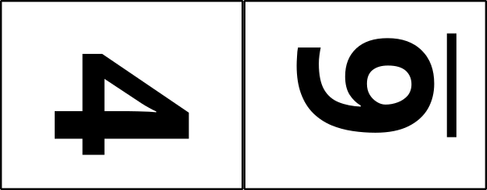

# Build resources directory

There are five layers in a box, and one chooses between the available fifth and sixth layers as the back of the box. The sixth layer is the same as the fifth layer but without any visible decoration.

The test layer is positioned such that it can overlay layer 2. After burning the test layer, one can burn a layer 2 on the same piece of material. Thus, one could do a first test burn, adjust the settings and orient the surface positioning a different layer 2 at the home position and do a second test burn with the new parameters. Then layer 2 burns can overlay the test burns.

These are the files used to burn in a laser cutter:

9"x12": , , , , , , and 

These are collages of layer images arranged tête-à-tête as follows:

18"x24": ,  and   
9"x24": , , , and 

Layers from the design files are copied into the individual objects files for organization purposes:

[`objects-1-9x12-collage-board-baseball-crane.svg`](objects-1-9x12-collage-board-baseball-crane.svg)  
[`objects-2-9x12-collage-board-baseball-crane.svg`](objects-2-9x12-collage-board-baseball-crane.svg)  
[`objects-3-9x12-collage-board-baseball-crane.svg`](objects-3-9x12-collage-board-baseball-crane.svg)  
[`objects-4-9x12-collage-board-baseball-crane.svg`](objects-4-9x12-collage-board-baseball-crane.svg)  
[`objects-5-9x12-collage-board-baseball-crane.svg`](objects-5-9x12-collage-board-baseball-crane.svg)  
[`objects-6-9x12-collage-board-baseball-crane.svg`](objects-6-9x12-collage-board-baseball-crane.svg)  
[`objects-T-9x12-collage-board-baseball-crane.svg`](objects-T-9x12-collage-board-baseball-crane.svg)  

The "objects" individual files then are copied to the "burn" individual files, replacing entirely the old "burn" individual files:

[`burn-1-9x12-collage-board-baseball-crane.svg`](burn-1-9x12-collage-board-baseball-crane.svg)  
[`burn-2-9x12-collage-board-baseball-crane.svg`](burn-2-9x12-collage-board-baseball-crane.svg)  
[`burn-3-9x12-collage-board-baseball-crane.svg`](burn-3-9x12-collage-board-baseball-crane.svg)  
[`burn-4-9x12-collage-board-baseball-crane.svg`](burn-4-9x12-collage-board-baseball-crane.svg)  
[`burn-5-9x12-collage-board-baseball-crane.svg`](burn-5-9x12-collage-board-baseball-crane.svg)  
[`burn-6-9x12-collage-board-baseball-crane.svg`](burn-6-9x12-collage-board-baseball-crane.svg)  
[`burn-T-9x12-collage-board-baseball-crane.svg`](burn-T-9x12-collage-board-baseball-crane.svg)  

The "burn" collage files then have the following modifications made before saving them as complete:

- all objects are selected and using the menu item "Path/Object to Path" to convert the fonts to paths
- a single magenta cut line is selected using right-click/Select Same.../Stroke color which selects every cut line in the entire collage
- the stroke width of all lines is changed with a single entry of .001in in the Fill and Stroke dialogue

Layers from the individual burn files are copied into the collage burn files:

[`burn-1345-18x24-collage-board-baseball-crane.svg`](burn-1345-18x24-collage-board-baseball-crane.svg)  
[`burn-1346-18x24-collage-board-baseball-crane.svg`](burn-1346-18x24-collage-board-baseball-crane.svg)  
[`burn-2222-18x24-collage-board-baseball-crane.svg`](burn-2222-18x24-collage-board-baseball-crane.svg)  
[`burn-13-9x24-collage-board-baseball-crane.svg`](burn-13-9x24-collage-board-baseball-crane.svg)  
[`burn-45-9x24-collage-board-baseball-crane.svg`](burn-45-9x24-collage-board-baseball-crane.svg)  
[`burn-46-9x24-collage-board-baseball-crane.svg`](burn-46-9x24-collage-board-baseball-crane.svg)  
[`burn-22-9x24-collage-board-baseball-crane.svg`](burn-22-9x24-collage-board-baseball-crane.svg)  

The PDF files created from the "burn" collage files are what are sent to the appropriate laser:

[`burn-1345-18x24-collage-board-baseball-crane.pdf`](burn-1345-18x24-collage-board-baseball-crane.pdf)  
[`burn-1346-18x24-collage-board-baseball-crane.pdf`](burn-1346-18x24-collage-board-baseball-crane.pdf)  
[`burn-2222-18x24-collage-board-baseball-crane.pdf`](burn-2222-18x24-collage-board-baseball-crane.pdf)  
[`burn-13-9x24-collage-board-baseball-crane.pdf`](burn-13-9x24-collage-board-baseball-crane.pdf)  
[`burn-45-9x24-collage-board-baseball-crane.pdf`](burn-45-9x24-collage-board-baseball-crane.pdf)  
[`burn-46-9x24-collage-board-baseball-crane.pdf`](burn-46-9x24-collage-board-baseball-crane.pdf)  
[`burn-22-9x24-collage-board-baseball-crane.pdf`](burn-22-9x24-collage-board-baseball-crane.pdf)  
