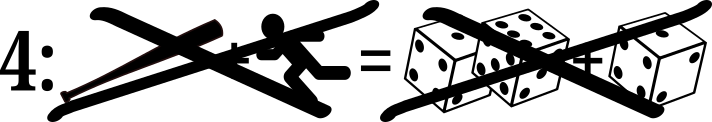
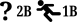
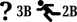

# A board baseball game to teach the sport to spectators

Copyright © Crane Softwrights Ltd.  
Development: [`https://github.com/CraneSoftwrights/board-baseball`](https://github.com/CraneSoftwrights/board-baseball)  
Tip jar: [`https://paypal.me/CraneSoftwrights`](https://paypal.me/CraneSoftwrights)  
Browser pages: [`https://cranesoftwrights.github.io/board-baseball/en/README.md.html`](https://cranesoftwrights.github.io/board-baseball/en/README.md.html)  

*(Skip the introduction and jump to: [Basic Play](#basic-mode-play-), [Extended Play](#extended-mode-play-), [Scoring a game](#scoring-a-game), [Design process](#design-process), or [Physical box and board representations](#physical-box-and-board-representations))*  

This project develops a board game along the lines of the basic long-played baseball board game, but brought up to date to include new rule changes at MLB. Differing from other board baseball games, this one aims to educate the players on the rules, the notations, and the conventions used when scoring a baseball game, using official abbreviations used by MLB.

Also, this version introduces an extended play that involves pitching, something not included in the original. With pitching, both players are rolling dice for each inning. There is sufficient detail in this alternative play that a game can be scored in order to practice scoring techniques. Crane's own scoring conventions are documented for consideration.

Both the original basic "only pitcher rolls dice" and this new extended "pitcher and batter both roll dice" are played on the same board with the basic mode using only a subset of the play pieces. The setup and play involved for both basic and extended modes of play are described below.

Three playing surfaces are available in this project: a paper version for use with foam backing and dress pins, and two wooden versions for use with cribbage pegs: a single-board version and a 6-layer-board version with a storage compartment:

     

## The essence of baseball play

At its core, baseball is a game of two teams, a visiting team and a home team, each taking turns in offense and defense. The goal for the offensive team (batting) is to score runs by successfully hitting the ball and advancing around a series of four bases arranged in a diamond shape. The defensive team (pitching) aims to prevent the offensive team from scoring by pitching, fielding the ball, and making outs to take offensive team players off the field.

At least nine innings are played, where in the "top" of the inning the visiting team is batting on offence and in the "bottom" of the inning the home team is batting on offence. The "middle" of the inning is the time between the top and bottom of the inning. The "end" of the inning is the time between the bottom of the inning and the top of the next inning. A given half-inning ends when the offence tallies three outs.

The batter can reach base and become a base runner if they are not put out in a defensive play. A run is scored when a base runner reaches home plate. The objective of the each team is to plate more runs than their opponent. The tally of runs and hits is tracked for both teams, and the tally always is reported in the order of the number of runs before the number of hits.

The concept of "scoring a game" is to transcribe a record of each of the plays, including if desired even each of the pitches, of every batter than comes to the plate. The pace and tenor of the game can be reviewed during the game and after the end of the game.

Should the home team be in the lead at the middle of the ninth inning, the game ends with the given score.

Should the home team become in the lead in the bottom of the ninth inning, the game ends with the given score and further runs are not attempted.

Should the visiting team be in the lead at the end of the ninth inning, the game ends with the given score.

Should the score be tied at the end of the ninth inning, an extra inning (both top and bottom halves) is played. 

In an extra inning, the team batting places the team's previous inning's final batter as a base runner at second base before the first batter of the extra inning approaches the plate for play.

Should the home team become in the lead in the bottom of the extra inning, the game ends with the given score and further runs are not attempted.

Should the visiting team be in the lead at the end of the extra inning, the game ends with the given score.

Should the score be tied at the end of the extra inning, another extra inning is played as described above.

## Basic-mode play 

Use the play board with this marking between the columns: , available for print in the PNG file: [`basic-board-baseball-crane.png`](../shared/basic-board-baseball-crane.png) (200mm x 248mm at 100% scale; suitable for both A4 and US-letter page sizes)

- see [Basic Setup](../shared/Z-SETUP.md) for details

- in the basic mode there is no separate pitching

- the player pitching rolls two dice to determine how the batter moves their pegs for the play according to the instructions at the dice combination below (click on the dice combination for details of each play):

| | | | | |
| :--- | :--- | :--- | :--- | :--- |
|| || ||
|| || ||
|| || ||
|| || ||
|| || ||
|| || ||
|| || ||

- in the basic mode there is no nuanced control for base runners

## Extended-mode play 

Use the play board with this marking between the columns: , available for print in the PNG file: [`extended-board-baseball-crane.png`](../shared/extended-board-baseball-crane.png) (200mm x 248mm at 100% scale; suitable for both A4 and US-letter page sizes)

- see [Extended Setup](../shared/X-SETUP.md) for details

- the team associated with the top (visiting) or bottom (home) of the inning goes up to bat and the opposing team pitches
- the pitcher uses one die (of a colour different from the dice used by the batter if available) to determine which pitch is thrown at the batter
- first some definitions on which pitching and batting are based:
  - the batter's strike zone is an imaginary area above home plate in the horizontal and extending in the vertical from the batter's knees up to the mid-point between the top of the batter's pants and the batter's shoulders 
  - a ball is a pitch thrown outside of the batter's strike zone when the batter does not "offer" at the pitch by swinging
  - a strike is a pitch thrown inside of the batter's strike zone or any pitch at which the batter offers by swinging
  - the batter making contact with the pitch but resulting in the ball being outside of the field between the third-base line and the first-base line makes, so outside the third-base line or outside the first-base line, for a "foul ball"
- three of the pitches result in no contact with the bat:
  - four balls  makes a walk and moves the batter to first base, which, if occupied, moves the first-base runner to second base, which, if occupied, moves the second-base runner to third base, which, if occupied, moves the third-base runner to home for a run
  - a swinging third strike  or a looking third strike  is an out for the batter and the out is recorded for the team's inning
  - when the pitched ball has no contact with the bat, and the result is not a walk, the  in the icon indicates that the batting team has the option of a base runner attempting to steal an open base depending on the outcome of throwing the runner's die
    - IMPORTANT: this is not a mandatory move and it is up to the batting team to choose to attempt to steal a base
    -  - stealing second base
      - when there is a base runner on first base and the second base is unoccupied:
        -  throwing a  or  indicates that the runner was caught stealing and the runner is called out and leaves the field
        -  throwing a , , , or  indicates that the runner successfully stole second base and an out is not recorded
    -  - stealing third base
      - when there is a base runner on second base and the third base is unoccupied:
        -  throwing a  indicates that the runner was caught stealing and the runner is called out and leaves the pitch
        -  throwing a , , , , or  indicates that the runner successfully stole third base and an out is not recorded
    - for some insight into the above choices, [ChatGPT was consulted](https://chat.openai.com/share/28530b4e-933a-408e-b516-6e1b7bbb4fcf) regarding past performance in Major League Baseball
- three of the pitches result in contact with the bat:
  - a foul ball  counts as a strike only when there are fewer than two strikes against the batter, otherwise there is no change in the tally of balls and strikes for the batter but it is counted as a strike on record for the pitcher
  - the batter making contact with the pitch with  or  puts the ball "in play" in the field between the third-base line and the first-base line
    - this is not counted as a strike against the batter, but it is counted as a strike on record for the pitcher
  - a base runner is not allowed to attempt to steal a base when the pitched ball is in contact with the bat
- the tally of runs and hits is recorded for the batter and always is reported in the order of number of balls before the number of strikes (e.g. a count of "2 and 1" means "two balls and one strike")

- when there are no base runners and the game is not being scored, the player batting rolls two dice to determine the play according to the instructions at the dice combination below (click on the dice combination for details of each play):

| | | | | |
| ---: | ---: | ---: | ---: | ---: |
|  |  |  |  |  |
|  |  |  |  |  |
|  |  |  |  |  |
|  |  |  |  |  |
|  |  |  |  |  |
|  |  |  |  |  |
|  |  |  |  |  |

- when there are base runners or the game is being scored, the batter rolls three dice (two dice of one colour for the batter and one die of a different colour for the base runners if available) to determine as above how the pitch is put in play and the impact of the play on the runners, thus guiding how the play is scored

## Scoring a game

Print [Crane's scorecard](../shared/scorecard-board-baseball-crane.pdf) to use to track the plays of a game.

See [the abbreviations summary](abbreviations.md) for a list of abbreviations used in scoring and in the plays described above.

See [the scoring summary](scoring.md) for information regarding Crane's conventions for scoring a baseball game.

## Design process

See the [design resources](design.md) for information regarding the design files and the initial steps in creating a release of files.

## Print, board, and box representations

Print to paper any playing surface using these PNG files at 200mm x 248mm at 100% scale; suitable for both A4 and US-letter page sizes:

- [Basic-mode play surface ](../shared/basic-board-baseball-crane.png)
- [Extended-mode play surface ](../shared/extended-board-baseball-crane.png)
- [Combination dual-mode play surface ](../shared/combo-board-baseball-crane.png)
- [Backing surface ](../shared/back-board-baseball-crane.png)

See the [shared directory](../shared) and [shared README](shared.md) for a collection of images used in documentation.

For board and box representations, see the [building instructions](build.md) for how the laser burn image files are created from the design files.

See the [burn directory](../burn) and [burn README](burn.md) for a collection of image files for laser engraving/cutting of game board and box layer materials.

See the [cuts directory](../cuts) and [cuts README](cuts.md) for a collection of image files for laser cutting of raw materials in preparation for engraving and cutting of game boards and box layers.
