# Build resources

Copyright © Crane Softwrights Ltd.  
Development: [`https://github.com/CraneSoftwrights/board-baseball`](https://github.com/CraneSoftwrights/board-baseball)  
Tip jar: [`https://paypal.me/CraneSoftwrights`](https://paypal.me/CraneSoftwrights)  
Browser pages: [`https://cranesoftwrights.github.io/board-baseball/en/build.md.html`](https://cranesoftwrights.github.io/board-baseball/en/build.md.html)  

In [this `build/` directory](../build) are the resources used to build two versions of the game using a laser cutter to etch and cut material:

- a 3-dimensional box with six layers of 1/8"-3mm material creating a storage compartment, and
  -   
- a single-board (of any thickness) with information on both sides
  -   

In the shared/ directory are paper resources (A4 or US-letter) to be used with a foam or styrofoam backing and dress pins:

- a [basic game](../shared/basic-board-baseball-crane.png), an [extended game](extended-board-baseball-crane.png), and a [combination game](../shared/combo-board-baseball-crane.png)
  -   

## 1. Terminology

| Legend | Key |
| ---- | ---- |  
| **A** = alignment hole  **B** = panel trench  **C** = panel  **D** = panel cradle  **E** = compartment  **F** = compartment lid  **G** = main board | 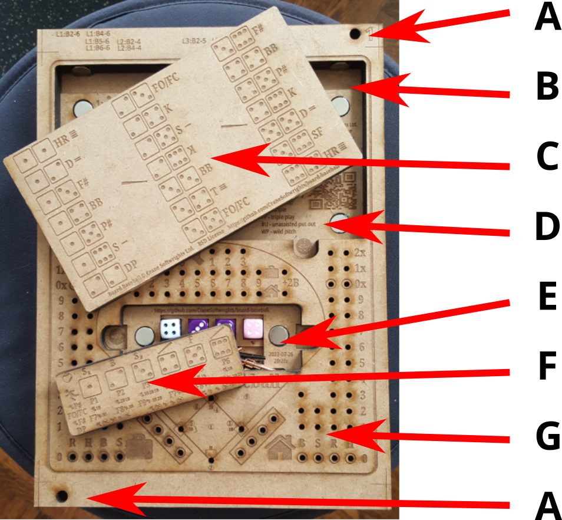 |  

## 2. Board levels and SVG layers

### 2.1 Six-layer 3D game boards

The design is optimized for six levels of 1/8"=3mm material that are laminated together to create a box 3/4"=19mm tall. Alternatively, one can use 3/16"=5mm material, but of course this would make the box 3/8" taller at 9/8"=29mm. This is mentioned because quality 1/8"=3mm material may be hard to find.

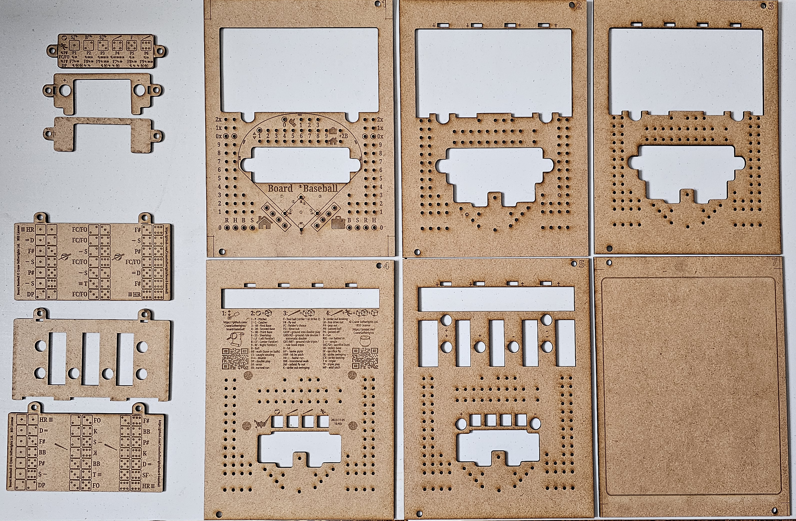  

Each level is made up of a number of SVG layers in the [design SVG master file](../design/design-board-baseball-crane.svg). See the [design notes](../design/#readme).

The levels are numbered to be distinguished from each other. At this time there are two choices for the back level: number 6 is blank and number 7 has a simple border. It is anticipated that future candidate back covers might include a written or graphic summary of the rules of play.

Levels 2 and 5 are special in that they have no visible printed or play content, only holes, chambers, and printed magnet polarity indicators. This property permits you to use an alternative material for levels 2 and 5 than for the other levels. All of the other levels have at least some exposure to the user, and the burning is designed to work if the material has only one "good" side, so it is not necessary to purchase material that has two "good" sides.

The test level is positioned such that it can overlay level 2. After burning the test level, one can burn a second test on the flip side of the same piece of material. Thus, one could do a first test burn, adjust the settings and orient the surface positioning a different level 2 at the home position and do a second test burn with the new parameters. Then level 2 burns can overlay the test burns.

### 2.2 Two-sided single-board 2D game boards

Two of the levels are designed to create single-board game boards, SBF (single board front) and SBB (single board back).

Many of the layers of the 3D game boards are used in the single-board game boards.

## 3. Materials

### 3.1 Materials list

In addition to the board material being cut and assembled, the following items are useful in construction and play. Included are illustrative examples of the commercial availability of some of the materials, though these are not to be regarded as recommendations or requirements, just examples of materials that have worked for the two designers:

- levels of burn and cut material
  - 1-count only for the single board version
  - 6-count in total for the box, possibly combined in larger dimensions of material
  - 9"x12" is assumed for every burn, accommodating 8"x10" and 200mmx248mm centred in 9"x12" frames
  - choice of dimensions and assuming thickness of 1/8"=3mm (alternatively 3/8"=5mm):
    - 9"x12" rectangles (burn includes alignment holes and crop marks)
    - 8"x10" rectangles (no alignment holes or crop marks)
    - "content" 200x248mm with rounded corners (no alignment holes or crop marks)
  - the equipment available to the designers works with either 9"x24", 18"x24", or 27"x24" pieces of material, thus governing the sizes below
    - using Inkscape one could build any arbitrary combination of  
  - the masters below accommodate your use of either 9"x12", 9"x24", 18"x24", or 27"x24" material dimensions
  - the play area is 200x248mm which fits both on A4 and US-letter paper page sizes and 8"x10" blanks
  - when working with acrylic, the local shop prohibits polycarbonates and permits polymethyl methacrylate (PMMA) 
- 12mm D6 dice
  - basic play - 2-count
  - extended play - 4-count optionally in three colours - one for pitching, two for batting, one for running
    - if only two dice are available, the pitcher throws one, then the batter throws both, then the batter throws one for the runner
  - e.g. [`https://www.amazon.ca/dp/B08F72SLYD`](https://www.amazon.ca/dp/B08F72SLYD)
- cribbage pegs
  - basic play - 14-count optionally in up to three colours (see [Basic setup](../shared/Z-SETUP.md))
  - extended play - 22-count optionally in up to three colours (see [Extended setup](../shared/X-SETUP.md))
  - e.g. [`https://www.amazon.ca/dp/B08B41LNS4`](https://www.amazon.ca/dp/B08B41LNS4)
    - note that 7 packages of 32 pegs makes up 10 games of 22 pegs with only four unused and the optimum 10+10+2 combination (use the [worksheet](../design/32-pegs.svg) to create game sets)
- single board version only:
  - 15mm or less diameter feet
    - 4-count
    - e.g. [`https://www.amazon.ca/dp/B07RYCRYY3`](https://www.amazon.ca/dp/B07RYCRYY3) but the screws provided are too long so 3/16"-length screws need to be purchased separately
- box version only:
  - 12mm x 3mm earth magnets
    - 18- or 20-count (see laminating steps)
    - e.g. [`https://www.amazon.ca/dp/B09XJ4SS23`](https://www.amazon.ca/dp/B09XJ4SS23) and [`https://www.amazon.ca/dp/B09XVBL8SK`](https://www.amazon.ca/dp/B09XVBL8SK)  
  - 1/4" bolt, nut, and two wide washers for alignment holes during board gluing
    - 6-count: two for the board, two for the compartment lid, two for the play panel
  - when using 3/16"=5mm thick material, one needs 12mm outside diameter washers 1/16" thick as filler to bring the 1/8" magnets flush with the surface of the material
    - 8-count

### 3.2 Important safety note

Remember that the magnets are small and dangerous for children should they become loose, much like the small dice and cribbage pegs only moreso.

## 4. Working with the magnets

It isn't important to know which side of the earth magnets is positive and which is negative, so long as you are consistent in making the interpretation the same for every magnet you are using. One helpful tip is to "label" your choice of positive for each magnet with a small piece of masking tape. Once all the magnets are in position for a given level, the tape can be removed before binding on the next level.

Each magnet hole has next to it an indication of which polarity is "up" when the material is placed flat on the table. Note that after laminating level 2 onto level 3 and all that is left is to laminate level 1, there are four vertically-mounted magnets near the top of the box. Each is annotated with the polarity direction for dropping in the magnet.

The earth magnets are very fragile and will shatter or shear off pieces if they are allowed to hit each other at rapid speed.

## 5. Laminating thoughts

Two approaches for assembling the six levels have been practiced by the designers:

- one session with all six levels:
  - place the bottom level facing down with the alignment bolts with a washer facing up
  - put adhesive on the back of level 5 and position on level 6
  - put adhesive on the front of level 5
  - place magnets in the horizontal locations only with the indicated polarity facing up
  - position level 4 on level 5
  - put adhesive on the back of level 3 and position on level 4
  - put adhesive on the front of level 3 and position level 2 on level 3
  - put adhesive on the front of level 2
  - place magnets in the vertical locations with the indicated polarity
  - position level 1 on level 2
  - anchor alignment bolts with a washer and the nut
  - clamp/weigh down the assembly for drying/curing
- two sessions, the first with five levels not including the backing level:
  - transcribe with a pen on the back of level 5 the polarity of the vertical magnet holes
  - transcribe with a pen on the back of level 5 the opposite polarity of the horizontal magnet holes
  - place level 5 facing up with the alignment bolts with a washer facing up
  - put adhesive on the front of level 5 and position level 4 on level 5
  - put adhesive on the back of level 3 and position on level 4
  - put adhesive on the front of level 3 and position level 2 on level 3
  - put adhesive on the front of level 2 and position level 1 on level 2
  - anchor alignment bolts with a washer and the nut
  - clamp/weigh the 5-piece assembly for drying/curing
  - inspect the completed assembly for any peg holes that need to be drilled out with a 1/8" bit, drilling from the back to the front
  - place the assembly facing down with the alignment bolts with a washer facing up
  - put adhesive on the back of level 5
  - place the magnets in the horizontal holes with the indicated handwritten changed polarity facing up
  - place the magnets in the vertical magnet holes with indicated handwritten unchanged polarity
  - position the backing level on level 5
  - clamp/weigh the 6-piece assembly for drying/curing
  
When working with both the panel and the compartment lid:

- place level 3 facing down with the alignment bolts with a washer facing up
- put adhesive on the back of level 2 and position on level 3
- put adhesive on the front of level 2
- place magnets in the appropriate locations with the indicated polarity facing up
- position level 1 on level 2
- clamp/weigh the 3-piece assembly for drying/curing

## 6. Burn files

### 6.1 Summary of files created during this process

Pages with a single digit are levels of a physical 3-D playing board.

The abbreviations "F" and "B" are, respectively, the front and back of the single-board playing board.

#### 6.1.1 Single surface files

These are the files used to burn in a laser cutter, tested in an Epilog Helix branded machine:

9"x12" frame: [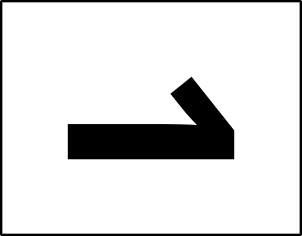](../burn/pdf/pdf/L1-frame-9x12-board-baseball-crane.pdf), , , [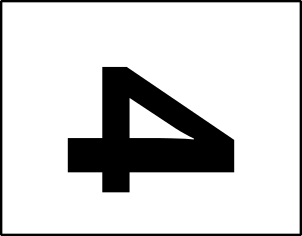](../burn/pdf/L4-frame-9x12-board-baseball-crane.pdf), , [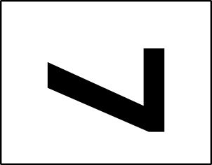](../burn/pdf/L7-frame-9x12-board-baseball-crane.pdf), and [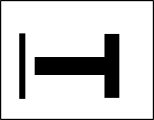](../burn/pdf/LT-frame-9x12-board-baseball-crane.pdf).  

9"x12" crop: , , , , ,  
, , , and .  

20mmx248mm cut: , , , , ,  
, , , and .  

#### 6.1.2 Collage files

These are collages of level images arranged tête-à-tête for board levels with a finished side that are user-facing:

9"x24": , , and 
18"x24": [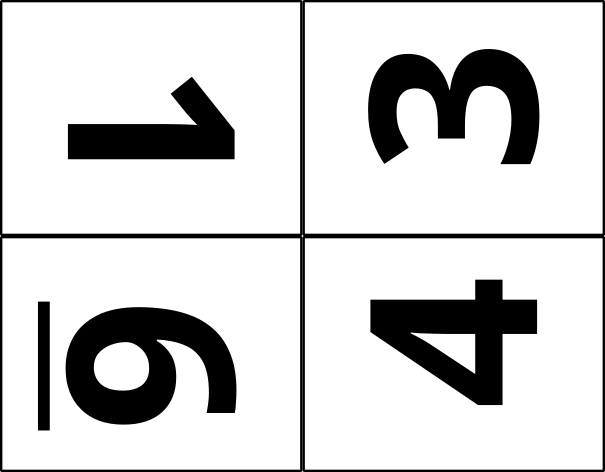](../burn/pdf/1364-18x24-board-baseball-crane.pdf) and [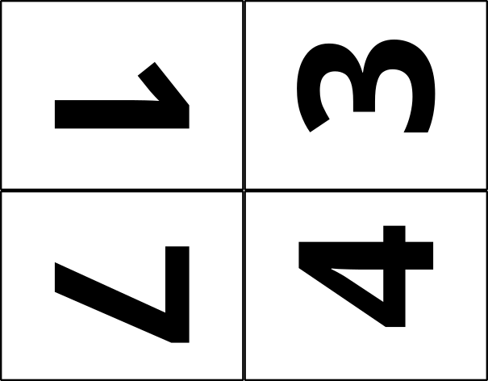](../burn/pdf/1374-18x24-board-baseball-crane.pdf)  

These are collages of level images arranged tête-à-tête for internal unfinished board levels that are not user-facing:

9"x24":   
18"x24": [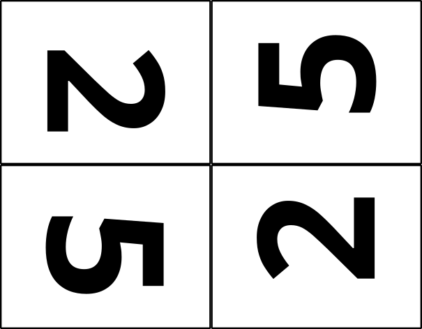](../burn/pdf/2552-18x24-board-baseball-crane.pdf)  

These are collages of level images arranged tête-à-tête for all boards in a single burn:

27"x24": [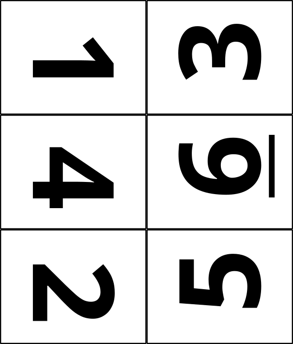](../burn/pdf/134625-18x24-board-baseball-crane.pdf) and [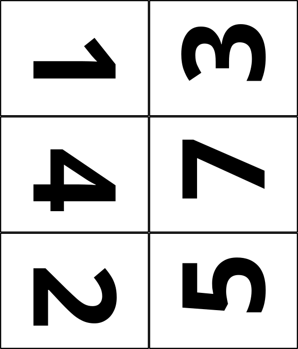](../burn/pdf/134725-18x24-board-baseball-crane.pdf)  

#### 6.1.3 Convenience cutting files

Two frame cutting patterns are available in order to make the scaffolding to hold a piece of material less than 9"x12" within the 9"x12" workspace:

8"x10" rectangle in 9"x12": [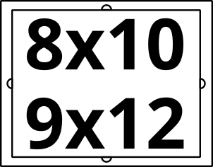](..cuts/pdf/frame-8x10-in-9x12.pdf)

200x248mm rounded rectangle in 9"x12":  [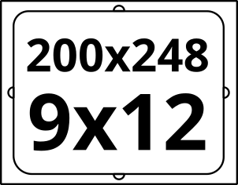](..cuts/pdf/frame-200x248-in-9x12.pdf)

A number of convenience cutting files (without any text) are available should you wish to carve up pieces of material with simple cuts:

8"x10": [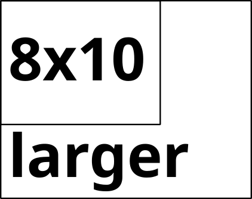](cut-8x10-from-larger.pdf)

18"x24": [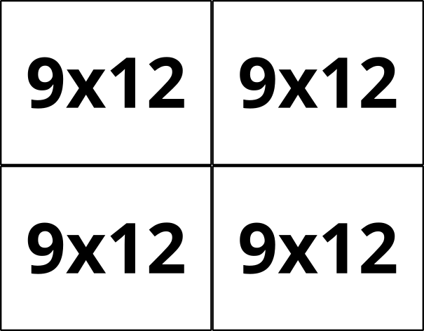](cut-9x12-from-18x24.pdf), [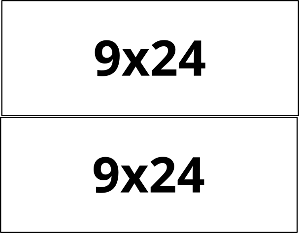](cut-9x24-from-18x24.pdf), and [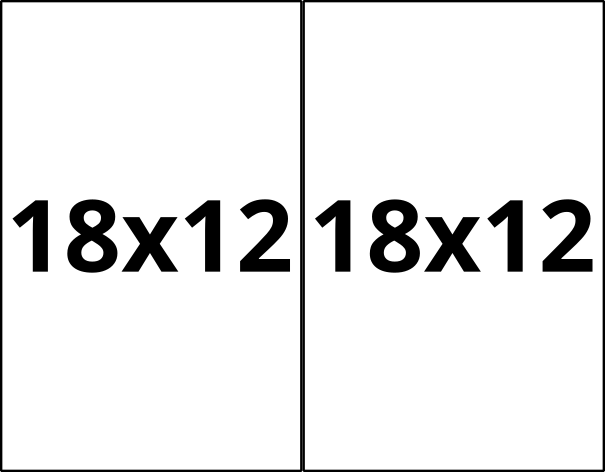](cut-18x12-from-18x24.pdf)  
18"x12": [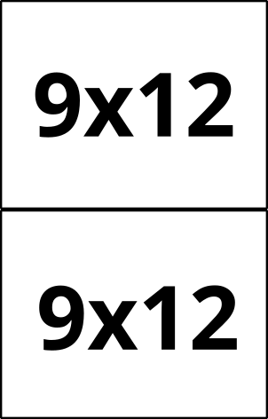](cut-9x12-from-18x12.pdf)
9"x24": [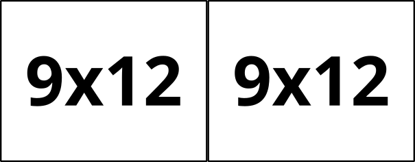](cut-9x12-from-9x24.pdf)
12"x20": [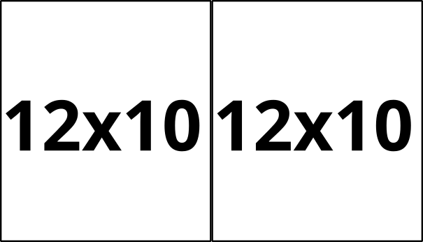](cut-12x10-from-12x20.pdf)

### 6.2 Creating the burn files

If the prior version of the burn files haven't been deleted, delete every `.pdf` file in the [`burn/pdf/`](../burn/pdf) directory and every `.svg` file in the [`burn/svg/`](../burn/svg) directory, leaving only the `README.md` file and `README.md.html` files in the directory.

Using the command line from the base git directory, create the [`burn/svg/review-board-baseball-crane.svg`](../burn/svg/review-board-baseball-crane.svg) file by running the `design2review` script:

- in Windows: `build\design2review.bat`
- in Shell: `sh build/design2review.sh`

Open the [`burn/svg/review-board-baseball-crane.svg`](../burn/svg/review-board-baseball-crane.svg) file and perform the following steps from within the "Layers and Objects" panel:

- select the top-most "Select this group..." group and use `Path/Object to Path` menu item to convert every object in every layer to a path (this ensures installed-font-independent portability)
  - *(the designers have experienced problems with the conversion being unsuccessful the first time; sometimes a second time helps; before continuing check that the version string has been changed into a path from its original text object)*
- un-group the top-most group
- save the SVG file before continuing
- review any of the combined layers that each represent the new output file by un-hiding the top-most layer of the combination
- close the SVG file without saving the changed status due to the review process

Using the command line from the base git directory, automatically create the individual burn SVG files by running the `review2burn` script:

- in Windows: `build\review2burn.bat`
- in Shell: `sh build/review2burn.sh`

From the [`burn/svg/`](../burn/svg/) directory open each of the nine collage SVG files (illustrated in [6.1.2 Collage files](#612-collage-files) and perform the following steps from within the "Layers and Objects" panel:

- press "4" to show the entire set of objects
- select the "tiling" sublayer and confirm the handles around the white rectangle
- in the "Document Properties" panel select "Resize to content" so that the new page background is only the tiling rectangle
- back in the "Layers and Objects" panel, for each content sublayer:
  - use one of the Rotate functions (clockwise or counterclockwise) as appropriate to put the top of each page in the middle of the content area
    - for examples:
      - 9"x24": 
      - 18"x24": 
      - 27"x24": 
  - use the "Align and Distribute" panel to position the rotated layer to the edges or centre of the new page size
- save the SVG file 

Open each of the four print SVG files (`SBF-print-*` and `SBB-print-*`) and perform the following steps without selecting any layers or objects:

- in the "Document Properties" panel select "Resize to content" so that the new page size is only the content seen without the white margins around the content
- in the "Export" panel, select the "Document" tab and the preview at the bottom should show no margin around the page content
- export the entire contents to PNG files in the "shared" directory for use in documentation:
  - `burn/svg/SBF-print-combo-board-baseball-crane.svg` to [`shared/combo-board-baseball-crane.png`](../shared/combo-board-baseball-crane.png)
  - `burn/svg/SBF-print-basic-board-baseball-crane.svg` to [`shared/basic-board-baseball-crane.png`](../shared/basic-board-baseball-crane.png)
  - `burn/svg/SBF-print-extended-board-baseball-crane.svg` to [`shared/extended-board-baseball-crane.png`](../shared/extended-board-baseball-crane.png)
  - `burn/svg/SBB-print-board-baseball-crane.svg` to [`shared/back-board-baseball-crane.png`](../shared/back-board-baseball-crane.png)
- save the SVG file and then close it

Using the command line from the base git directory, automatically create the individual burn PDF files by running the `burn2pdf` script:

- in Windows: `burn\burn2pdf.bat`
- in Shell: `sh burn/burn2pdf.sh 2>/dev/null` *(you may get away without redirecting stderr, but Inkscape burps a lot)*

The end result is 38 PDF files listed alphabetically as follows:

[`burn/pdf/13-9x24-collage-board-baseball-crane.pdf`](../burn/pdf/13-9x24-collage-board-baseball-crane.pdf)  
[`burn/pdf/134625-27x24-collage-board-baseball-crane.pdf`](../burn/pdf/134625-27x24-collage-board-baseball-crane.pdf)  
[`burn/pdf/134725-27x24-collage-board-baseball-crane.pdf`](../burn/pdf/134725-27x24-collage-board-baseball-crane.pdf)  
[`burn/pdf/1364-18x24-collage-board-baseball-crane.pdf`](../burn/pdf/1364-18x24-collage-board-baseball-crane.pdf)  
[`burn/pdf/1374-18x24-collage-board-baseball-crane.pdf`](../burn/pdf/1374-18x24-collage-board-baseball-crane.pdf)  
[`burn/pdf/25-9x24-collage-board-baseball-crane.pdf`](../burn/pdf/25-9x24-collage-board-baseball-crane.pdf)  
[`burn/pdf/2552-18x24-collage-board-baseball-crane.pdf`](../burn/pdf/2552-18x24-collage-board-baseball-crane.pdf)  
[`burn/pdf/46-9x24-collage-board-baseball-crane.pdf`](../burn/pdf/46-9x24-collage-board-baseball-crane.pdf)  
[`burn/pdf/47-9x24-collage-board-baseball-crane.pdf`](../burn/pdf/47-9x24-collage-board-baseball-crane.pdf)  
[`burn/pdf/L1-crop-9x12-board-baseball-crane.pdf`](../burn/pdf/L1-crop-9x12-board-baseball-crane.pdf)  
[`burn/pdf/L1-cut-200x248-board-baseball-crane.pdf`](../burn/pdf/L1-cut-200x248-board-baseball-crane.pdf)  
[`burn/pdf/L1-frame-9x12-board-baseball-crane.pdf`](../burn/pdf/L1-frame-9x12-board-baseball-crane.pdf)  
[`burn/pdf/L2-crop-9x12-board-baseball-crane.pdf`](../burn/pdf/L2-crop-9x12-board-baseball-crane.pdf)  
[`burn/pdf/L2-cut-200x248-board-baseball-crane.pdf`](../burn/pdf/L2-cut-200x248-board-baseball-crane.pdf)  
[`burn/pdf/L2-frame-9x12-board-baseball-crane.pdf`](../burn/pdf/L2-frame-9x12-board-baseball-crane.pdf)  
[`burn/pdf/L3-crop-9x12-board-baseball-crane.pdf`](../burn/pdf/L3-crop-9x12-board-baseball-crane.pdf)  
[`burn/pdf/L3-cut-200x248-board-baseball-crane.pdf`](../burn/pdf/L3-cut-200x248-board-baseball-crane.pdf)  
[`burn/pdf/L3-frame-9x12-board-baseball-crane.pdf`](../burn/pdf/L3-frame-9x12-board-baseball-crane.pdf)  
[`burn/pdf/L4-crop-9x12-board-baseball-crane.pdf`](../burn/pdf/L4-crop-9x12-board-baseball-crane.pdf)  
[`burn/pdf/L4-cut-200x248-board-baseball-crane.pdf`](../burn/pdf/L4-cut-200x248-board-baseball-crane.pdf)  
[`burn/pdf/L4-frame-9x12-board-baseball-crane.pdf`](../burn/pdf/L4-frame-9x12-board-baseball-crane.pdf)  
[`burn/pdf/L5-crop-9x12-board-baseball-crane.pdf`](../burn/pdf/L5-crop-9x12-board-baseball-crane.pdf)  
[`burn/pdf/L5-cut-200x248-board-baseball-crane.pdf`](../burn/pdf/L5-cut-200x248-board-baseball-crane.pdf)  
[`burn/pdf/L5-frame-9x12-board-baseball-crane.pdf`](../burn/pdf/L5-frame-9x12-board-baseball-crane.pdf)  
[`burn/pdf/L6-crop-9x12-board-baseball-crane.pdf`](../burn/pdf/L6-crop-9x12-board-baseball-crane.pdf)  
[`burn/pdf/L6-cut-200x248-board-baseball-crane.pdf`](../burn/pdf/L6-cut-200x248-board-baseball-crane.pdf)  
[`burn/pdf/L7-crop-9x12-board-baseball-crane.pdf`](../burn/pdf/L7-crop-9x12-board-baseball-crane.pdf)  
[`burn/pdf/L7-cut-200x248-board-baseball-crane.pdf`](../burn/pdf/L7-cut-200x248-board-baseball-crane.pdf)  
[`burn/pdf/L7-frame-9x12-board-baseball-crane.pdf`](../burn/pdf/L7-frame-9x12-board-baseball-crane.pdf)  
[`burn/pdf/LT-frame-9x12-board-baseball-crane.pdf`](../burn/pdf/LT-frame-9x12-board-baseball-crane.pdf)  
[`burn/pdf/SBB-cut-200x248-board-baseball-crane.pdf`](../burn/pdf/SBB-cut-200x248-board-baseball-crane.pdf)  
[`burn/pdf/SBB-frame-9x12-board-baseball-crane.pdf`](../burn/pdf/SBB-frame-9x12-board-baseball-crane.pdf)  
[`burn/pdf/SBB-print-board-baseball-crane.pdf`](../burn/pdf/SBB-print-board-baseball-crane.pdf)  
[`burn/pdf/SBF-cut-200x248-board-baseball-crane.pdf`](../burn/pdf/SBF-cut-200x248-board-baseball-crane.pdf)  
[`burn/pdf/SBF-frame-9x12-board-baseball-crane.pdf`](../burn/pdf/SBF-frame-9x12-board-baseball-crane.pdf)  
[`burn/pdf/SBF-print-basic-board-baseball-crane.pdf`](../burn/pdf/SBF-print-basic-board-baseball-crane.pdf)  
[`burn/pdf/SBF-print-combo-board-baseball-crane.pdf`](../burn/pdf/SBF-print-combo-board-baseball-crane.pdf)  
[`burn/pdf/SBF-print-extended-board-baseball-crane.pdf`](../burn/pdf/SBF-print-extended-board-baseball-crane.pdf)  

Open every PDF file and:

- perform one final check on the content of the page
- if necessary, use your PDF tool to rotate the image to the orientation needed for your cutter
  - in the case of the PDF files stored in git, all single surface PDF files have been rotated according to the indications in [6.1.1 Single surface files](#611-single-surface-files)
- save your PDF rotated as needed

At this point the production of the burn files is complete and the new version can be committed to git and pushed to the server.

The PDF files in the `cuts/pdf/` directory shouldn't need to change:

[`cuts/pdf/frame-8x10-in-9x12.pdf`](../cuts/pdf/frame-8x10-in-9x12.pdf)  
[`cuts/pdf/frame-220x248-in-9x12.pdf`](../cuts/pdf/frame-220x248-in-9x12.pdf)  
[`cuts/pdf/cut-8x10-from-larger.pdf`](../cuts/pdf/cut-8x10-from-larger.pdf)  
[`cuts/pdf/cut-9x12-from-9x24.pdf`](../cuts/pdf/cut-9x12-from-9x24.pdf)  
[`cuts/pdf/cut-9x12-from-18x12.pdf`](../cuts/pdf/cut-9x12-from-18x12.pdf)  
[`cuts/pdf/cut-9x12-from-18x24.pdf`](../cuts/pdf/cut-9x12-from-18x24.pdf)  
[`cuts/pdf/cut-9x24-from-18x24.pdf`](../cuts/pdf/cut-9x24-from-18x24.pdf)  
[`cuts/pdf/cut-18x12-from-18x24.pdf`](../cuts/pdf/cut-18x12-from-18x24.pdf)  

## 7. Scorecard production

Open [scorecard SVG file](../../design/scorecard-board-baseball-crane.svg):

1. Make edits as required
1. Save SVG master with the watermark
1. Save SVG to a junk location for printing purposes
1. In the `Layers and Objects` panel, select the scorecard apex item
1. Use `Path/Object to Path` menu item to convert every object to a path (this ensures installed-font-independent portability)
1. Confirm that the Version string no longer is a text object but now is a path
1. Delete the watermark reminding of the conversion step
1. Save the junk SVG
1. Export the contents to `../shared/scorecard-board-baseball-crane.png`
1. Remember to print the PNG file at 100%

## 8. Creating a ZIP of the XHTML of the Markdown files

This shell script (not available as a Windows batch file) has two tool dependencies not included in the git repository that must be on the command path:

- pandoc - conversion of markdown to HTML
- tidy - conversion of HTML to XHTML

1. Run: `sh build/documentation.sh` to create `documentation-board-baseball-crane.zip`
1. Remember to update the web site with the latest

## 9. Creating a git release from QA or Final

1. Set the tag to be `CCYYMMDD-HHMMz-QA` or `CCYYMMDD-HHMMz-Final`
1. Use the "Generate release notes" button to populate the notes
1. Attach the four board PNG files to the release as binaries
1. Attach the documentation ZIP to the release as a binary
1. Publish the release
1. Confirm the latest release on the home page

## 10. Assembly

Our second test build is documented with photographs [here: `../build/test-20230728.md`](../build/test-20230728.md).

Various timings of other test builds are documented [here: `../build/other-tests.md`](../build/other-tests.md).

