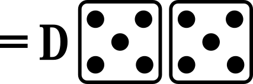

- a home run

- a double

- a fly out to an outfield fielder

- a base on balls

- a pop-out to an infield fielder

- a single

- a double play (two outs)

- a force out or a fielder's choice (see [FO-FC](#fo-fc))

- a strike out on a swinging strike

- a single

- a force out or a fielder's choice (see [FO-FC](#fo-fc))

- a single

- a triple

- a force out or a fielder's choice (see [FO-FC](#fo-fc))

- a fly out to an outfield fielder

- a single

- a pop-out to an infield fielder

- a force out or a fielder's choice (see [FO-FC](#fo-fc))

- a double

- a fly out to an outfield fielder

- a home run

