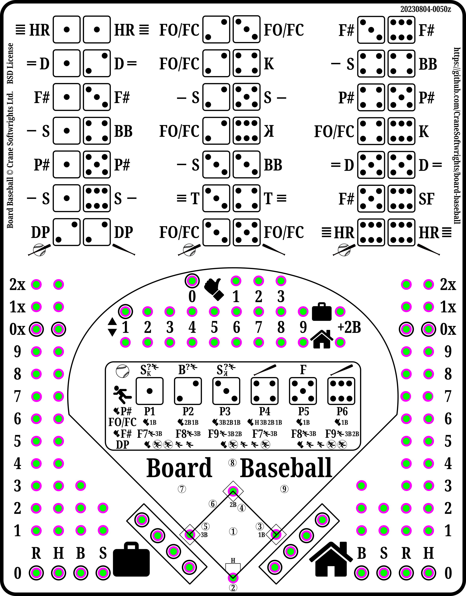
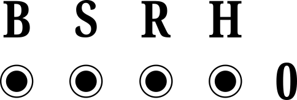

| :---: |
| 
|  |
| 

## 22 x A

| |A|
| :---: | :---: |
| |  |
| |  |
|  | 
| | 
| | 
| : | 
| | 
| | 

## 2 x A, 10 x B, 10 x C

|A|B|C|
| :---: | :---: | :---:
| |  | 
|  |  | 
|  |  | 
| |  | 

## 6 x A, 8 x B, 8 x C

|A|B|C|
| :---: | :---: | :---:
| |  | 
|  |   | 
|  |  | 
|  | | | 
|  | | |
