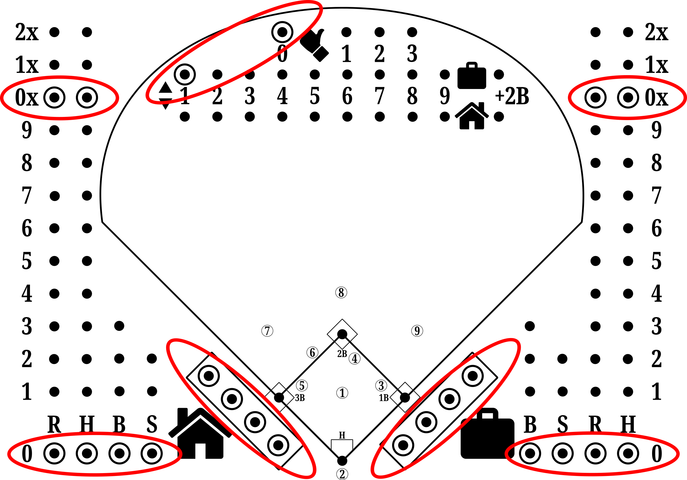
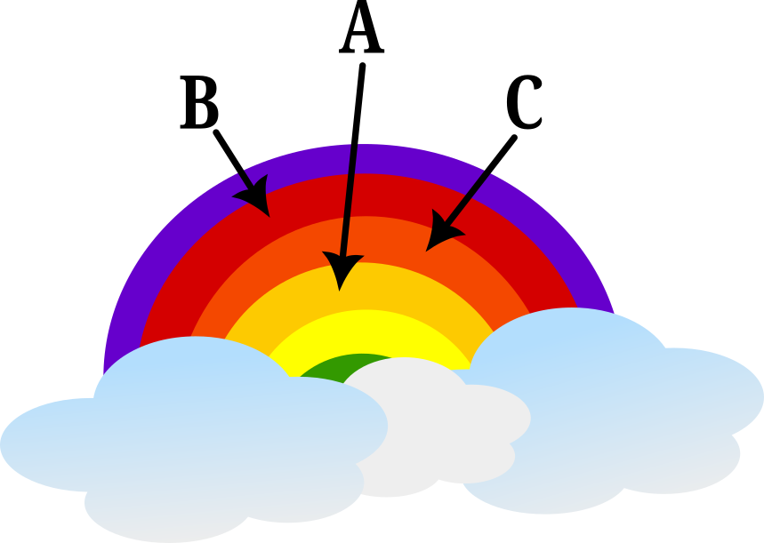
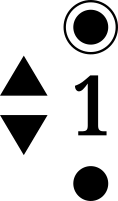
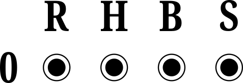
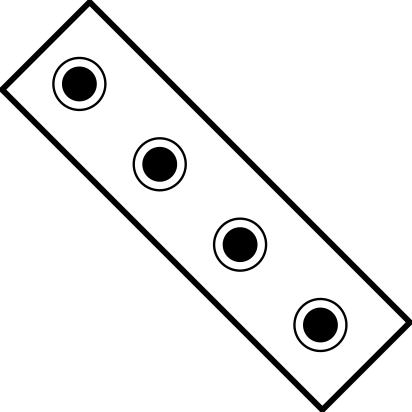

  

 [22 x A](X-SETUP.md#22-x-a) / [2 x A, 10 x B, 10 x C](X-SETUP.md#2-x-a-10-x-b-10-x-c) / [6 x A, 8 X B, 8 x C](X-SETUP.md#6-x-a-8-x-b-8-x-c)

## 22 x A

| |A|
| :---: | :---: |
| |  |
| |  |
| : | 
| | 
| | 
|  | 
| | 
| | 

## 2 x A, 10 x B, 10 x C

|A|B|C|
| :---: | :---: | :---:
| |  | 
|  |  | 
|  |  | 
| |  | 

## 6 x A, 8 x B, 8 x C

|A|B|C|
| :---: | :---: | :---:
| |  | 
|  |   | 
|  |  | 
|  | | | 
|  | | |
