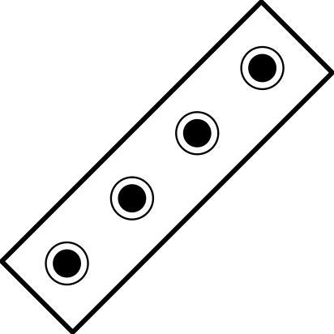

# 

 

 

## 22 x A

### A:
-  
-  
:
- 
- 
- 
:
- 
- 
- 

## 2 x A, 10 x B, 10 x C

### A:
-  
-  

### B:
:
- 
- 
- 

### C:
:
- 
- 
- 

## 6 x A, 8 x B, 8 x C

### A:
-  
-  
- 
- 

### B:
:
- 
- 

### C:
:
- 
- 

